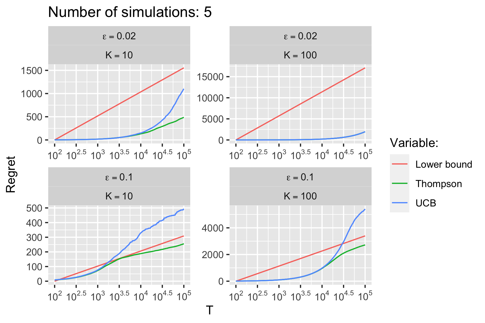
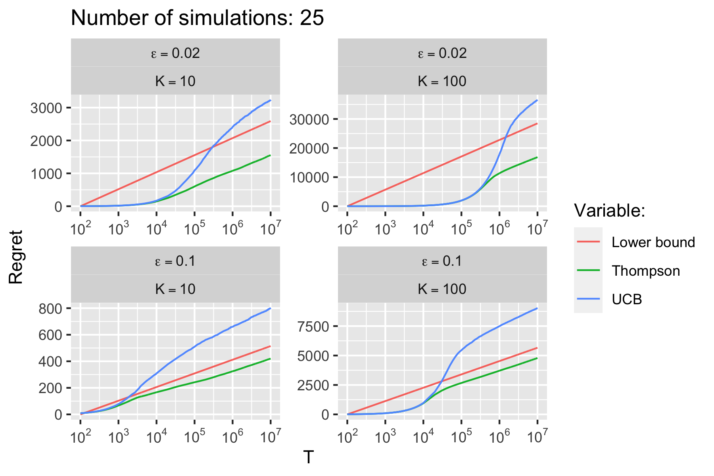
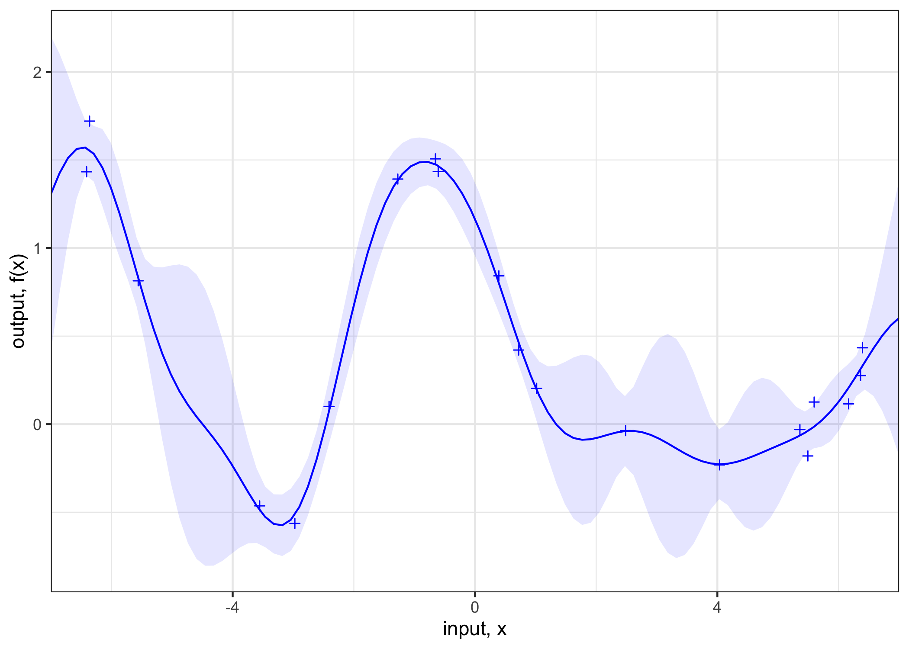

```{r setup, include=FALSE}
knitr::opts_chunk$set(
  echo = TRUE,
  out.width = 500,
  fig.align = "center"
)
```

## Multi-Armed Bandit problems

[Problem Set 2](ps2_answers.html) replicates an empirical evaluation of Thompson Sampling [@chapelle2011empirical]. Code for this problem has been implemented in R and performance-enhanced through `Rcpp` (`C++`).

To run the simulation from the command line, simply execute the command below. This will clone the git repo to your device and run the simulation with parameters specified in `run_simulation`.

```{bash, eval=F}
git clone https://github.com/pat-alt/reinforcement_learning.git
cd reinforcement_learning
Rscript -e 'source("requirements.R"); run_simulation(n_sim=5,horizon=1e6,update_every = 100)'  
open 'www/user_sim.png'
```

With the given set of parameters the computations should only take a few minutes and the resulting chart should looks something like this:

```{r}

```

The results from the full simulation are shown below. All details and documentation can be found in the [HTML document](ps2_answers.html).

```{r}

```

## Gaussian Processes

The first part of [Problem Set 3](ps3_answers.html) ...

```{r}

```

## Bayesian Optimization

The Bayes Optizer gradually gets better at estimated the true function values. As it explores different points on the test grid uncertainty around these points shrinks. Sometimes the overall magnitude of the confidence interval suddenly appears to change which corresponds to occasions when the estimates of optimal hyperparameters change significantly. Eventually the learned function values are very close to true function values and the proposed optimum corresponds to the true optimum (among the test points).

```{r}
knitr::include_graphics("www/bayes_opt.gif")
```


## References

<div id="refs"></div>

## Session Info

```{r}
utils::sessionInfo()
```


