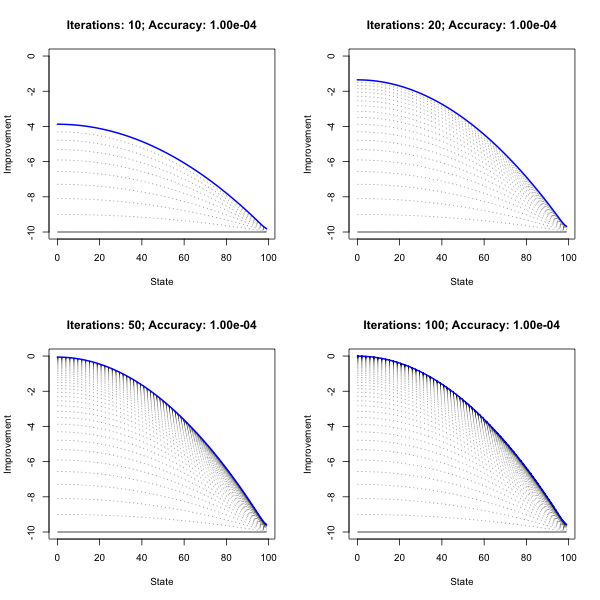
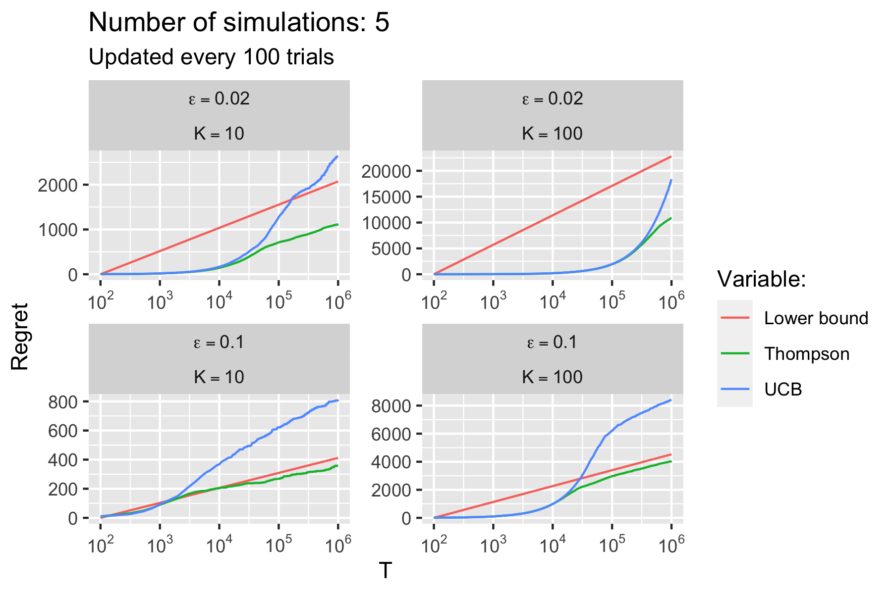
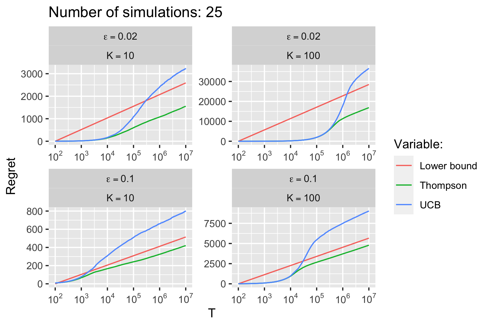
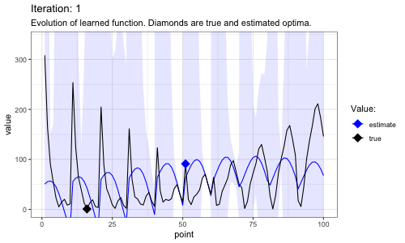
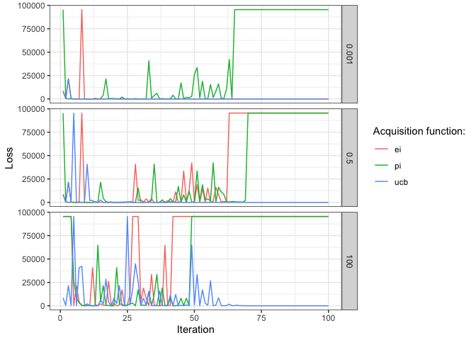

> NOTE: Exercises were either proposed or designed by the course
> instructores, [Gergely Neu](http://cs.bme.hu/~gergo/) and [Hrvoje
> Stojic](https://hstojic.re/).

## Dynamic Programming

[Problem Set 1](ps1_answers.html) is about implementing policy
evaluation and iteration methods for a simple Markov Decision Process.
Implementation in R closely follows Sutton and Barto (2018). The chart
below demonstrates how the optimal policy and value function is
gradually learned through value iteration.

``` r

```


## Multi-Armed Bandit problems

[Problem Set 2](ps2_answers.html) replicates an empirical evaluation of
Thompson Sampling (Chapelle and Li 2011). Code for this problem has been
implemented in R and performance-enhanced through `Rcpp` (`C++`).

To run the simulation from the command line, simply execute the command
below. This will clone the git repo to your device and run the
simulation with parameters specified in `run_simulation`.

``` bash
git clone https://github.com/pat-alt/reinforcement_learning.git
cd reinforcement_learning
Rscript -e 'source("requirements.R"); run_simulation(n_sim=5,horizon=1e6,update_every = 100)'  
open 'www/user_sim.png'
```

With the given set of parameters the computations should only take a few
minutes and the resulting chart should looks something like this:

``` r

```


The results from the full simulation are shown below. All details and
documentation can be found in the [HTML document](ps2_answers.html).

``` r

```


## Gaussian Processes

The first part of [Problem Set 3](ps3_answers.html) is about Gaussian
Process Regression. The plot below shows the output from a Gaussian
Process Regression with 20 training points.

``` r
knitr::include_graphics("www/gp_reg.png")
```


## Bayesian Optimization

The Bayes Optimizer gradually gets better at estimated the true function
values. As it explores different points on the test grid uncertainty
around these points shrinks. Sometimes the overall magnitude of the
confidence interval suddenly appears to change which corresponds to
occasions when the estimates of optimal hyperparameters change
significantly. Eventually the learned function values are very close to
true function values and the proposed optimum corresponds to the true
optimum (among the test points).

``` r

```


The Figure below shows the loss evolution with different acquisition
functions for varying exploration parameters (by row). For UCB and EI
the results are intuitive with the former performing better overall: as
the exploration rate increases they are more likely to explore and hence
at times commit errors. For PI the results are poor across the board.
The choices of the eploration rate may be too high for PI. Another
explanation may be that due to computational constraints, I have run the
multi-started hyperparameter optimization only every five iterations.

<div class="figure" style="text-align: center">


<p class="caption">
Comparison of loss evolution with different acquisition functions for
varying exploration parameters (by row).
</p>

</div>

## Approximate Dynamic Programming

There are two fundamental challenges of reinforcement learning (RL):

1.  Reward and transition functions are unknown.
2.  The state and action space are large.

Approximate Dynamic Programming deals with both challenges.

The chart below shows the approximate evaluations of the two
deterministic policies for different numbers of sample transitions
(across columns) and different feature maps (across rows). Broadly
speaking the estimates tend to be less noisy as the number of sample
transitions increases.


Approximate policy iteration is noisy for high states. Nonetheless the
proposed policies are close two optimal:


## References

<div id="refs" class="references csl-bib-body hanging-indent">

<div id="ref-chapelle2011empirical" class="csl-entry">

Chapelle, Olivier, and Lihong Li. 2011. “An Empirical Evaluation of
Thompson Sampling.” *Advances in Neural Information Processing Systems*
24: 2249–57.

</div>

<div id="ref-sutton2018reinforcement" class="csl-entry">

Sutton, Richard S, and Andrew G Barto. 2018. *Reinforcement Learning: An
Introduction*. MIT press.

</div>

</div>

## Session Info

``` r
utils::sessionInfo()
```

    ## R version 4.0.3 (2020-10-10)
    ## Platform: x86_64-apple-darwin17.0 (64-bit)
    ## Running under: macOS High Sierra 10.13.6
    ## 
    ## Matrix products: default
    ## BLAS:   /Library/Frameworks/R.framework/Versions/4.0/Resources/lib/libRblas.dylib
    ## LAPACK: /Library/Frameworks/R.framework/Versions/4.0/Resources/lib/libRlapack.dylib
    ## 
    ## locale:
    ## [1] en_US.UTF-8/en_US.UTF-8/en_US.UTF-8/C/en_US.UTF-8/en_US.UTF-8
    ## 
    ## attached base packages:
    ## [1] stats     graphics  grDevices utils     datasets  methods   base     
    ## 
    ## other attached packages:
    ## [1] ggplot2_3.3.3     data.table_1.14.0
    ## 
    ## loaded via a namespace (and not attached):
    ##  [1] knitr_1.30        magrittr_2.0.1    tidyselect_1.1.0  munsell_0.5.0    
    ##  [5] colorspace_2.0-1  R6_2.5.0          rlang_0.4.11      fansi_0.5.0      
    ##  [9] highr_0.8         dplyr_1.0.2       stringr_1.4.0     tools_4.0.3      
    ## [13] grid_4.0.3        gtable_0.3.0      xfun_0.23         utf8_1.2.1       
    ## [17] withr_2.4.2       htmltools_0.5.1.1 ellipsis_0.3.2    yaml_2.2.1       
    ## [21] digest_0.6.27     tibble_3.1.2      lifecycle_1.0.0   crayon_1.4.1     
    ## [25] farver_2.1.0      purrr_0.3.4       vctrs_0.3.8       glue_1.4.2       
    ## [29] evaluate_0.14     rmarkdown_2.6     labeling_0.4.2    stringi_1.5.3    
    ## [33] compiler_4.0.3    pillar_1.6.1      generics_0.1.0    scales_1.1.1     
    ## [37] pkgconfig_2.0.3
