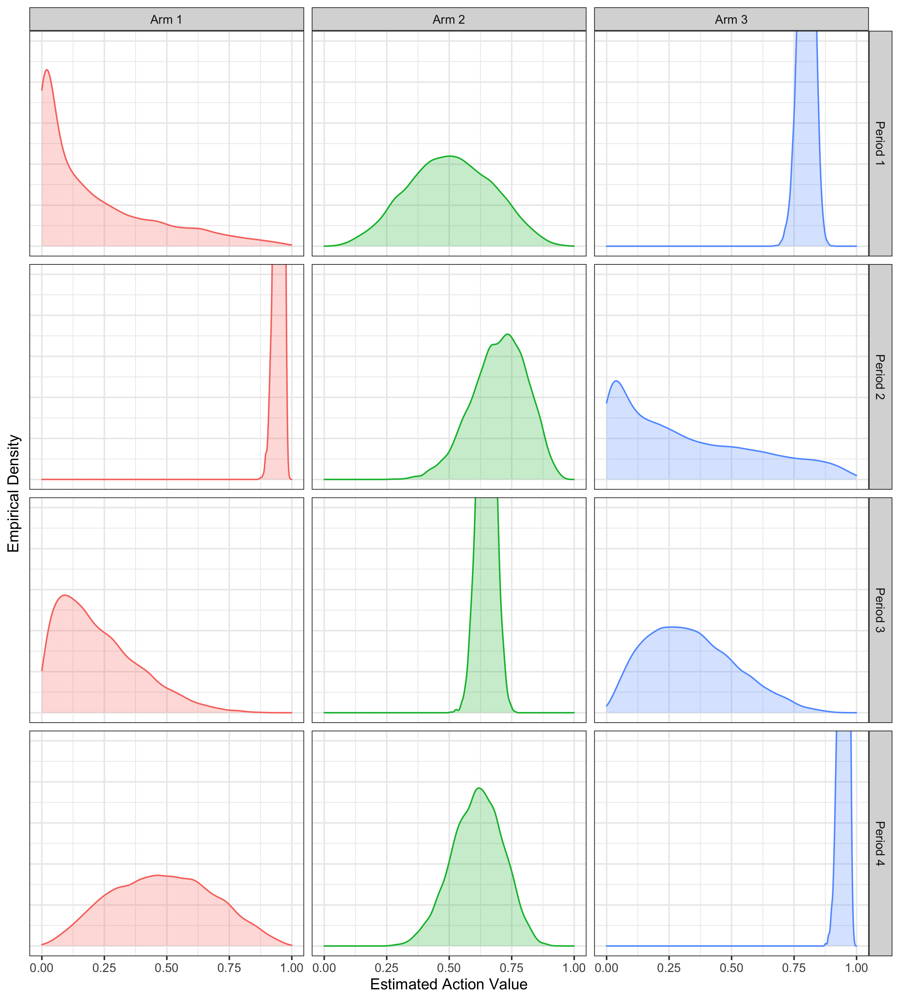
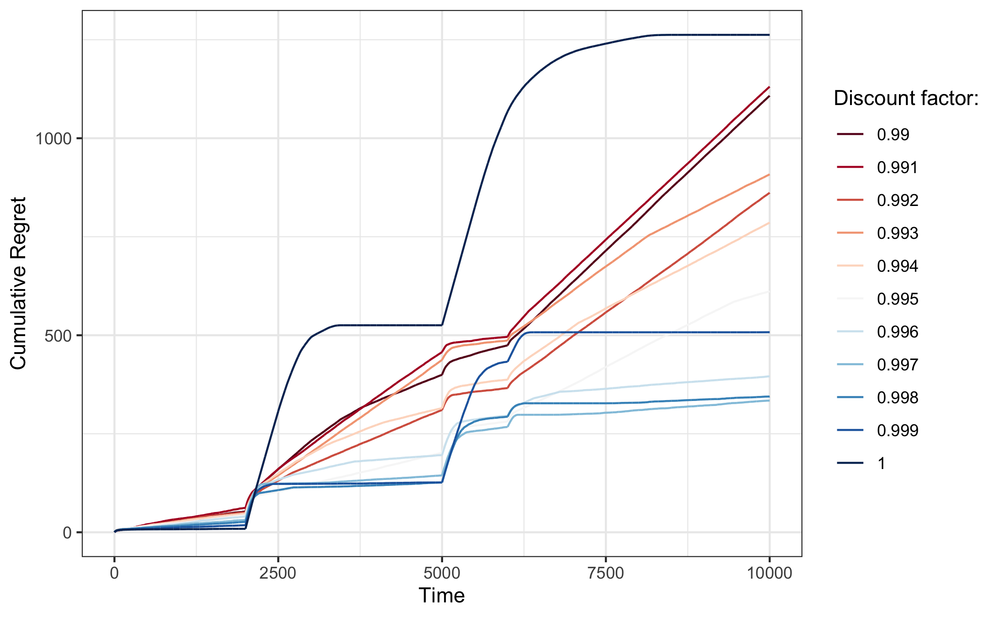

## Discounted Thompson Sampling {#disc}

Now that we have seen some preliminary evidence in favour of discounted Thompson Sampling for non-stationary multi-armed bandits, in this section we will investigate the empirical performance of that algorithm a little further. To this end we have implemented the algorithm in `C++` for greater computational efficiency.

```{r, eval=FALSE}
delta <- 0.995
n_sim <- 100
probs[,t := .I] # at time indicator
posteriours <- rbindlist(
  lapply(
    1:length(bounds),
    function(i) {
      prob <- as.matrix(probs[t<=bounds[i]])
      set.seed(42)
      nonstationary_mab <- mab(prob[,-ncol(prob)])
      unpack(nonstationary_mab)
      sim <- sim_thompson_discounted(
        n = n_sim,
        horizon = horizon,
        K = K,
        prob = prob,
        discount_factor = 0.995,
        update_every = 1,
        method = method,
        successes_ = NULL,
        failures_ = NULL
      )
      out <- data.table(
        arm = 1:length(sim$successes),
        alpha = sim$successes,
        beta = sim$failures,
        period = i
      )
      return(out)
    }
  )
)

```

```{r, fig.height=10, fig.width=9, eval=FALSE}
n_draws <- 10000
posteriour_dist <- posteriours[
  ,
  .(beta = rbeta(n_draws, alpha, beta)),
  by = .(period, arm)
]
posteriour_dist[,arm:=sprintf("Arm %i", arm)]
posteriour_dist[,period:=sprintf("Period %i", period)]
ggplot(data=posteriour_dist, aes(x=beta, fill=arm, colour=arm)) +
  geom_density(alpha=0.25, show.legend = FALSE) +
  facet_grid(
    cols=vars(arm),
    rows=vars(period)
  ) +
  labs(
    x="Estimated Action Value",
    y="Empirical Density"
  ) +
  coord_cartesian(ylim=c(0,5)) +
  theme(
    axis.text.y = element_blank(),
    axis.ticks.y = element_blank()
  )
ggsave("www/posteriour_ts.png")
```

```{r period-ts, fig.cap="Empirical distribution of estimated action values for different periods and corresponding piece-wise stationary probabilites."}

```


```{r, eval=FALSE}
delta <- seq(0.99,1,by=0.001)
n_sim <- 10
probs[,t := NULL] # at time indicator
prob <- as.matrix(probs)
set.seed(42)
nonstationary_mab <- mab(prob)
unpack(nonstationary_mab)
regret <- rbindlist(
  lapply(
    1:length(delta),
    function(i) {
      sim <- sim_thompson_discounted(
        n = n_sim,
        horizon = horizon,
        K = K,
        prob = prob,
        discount_factor = delta[i],
        update_every = 1,
        method = method,
        successes_ = NULL,
        failures_ = NULL
      )
      out <- data.table(
        cum_regret = cumsum(sim$regret),
        delta = delta[i],
        t = 1:length(sim$regret)
      )
      return(out)
    }
  )
)
```

```{r, eval=FALSE}
p <- ggplot(data=regret, aes(x=t, y=cum_regret, colour=factor(delta))) +
  geom_line() +
  scale_color_brewer(name="Discount factor:", palette = "RdBu") +
  labs(
    x="Time",
    y="Cumulative Regret"
  )
p
ggsave("www/ts_discount_rate.png")
```


```{r disc, fig.cap="The effect of the discount factor on cumulative regret."}

```
