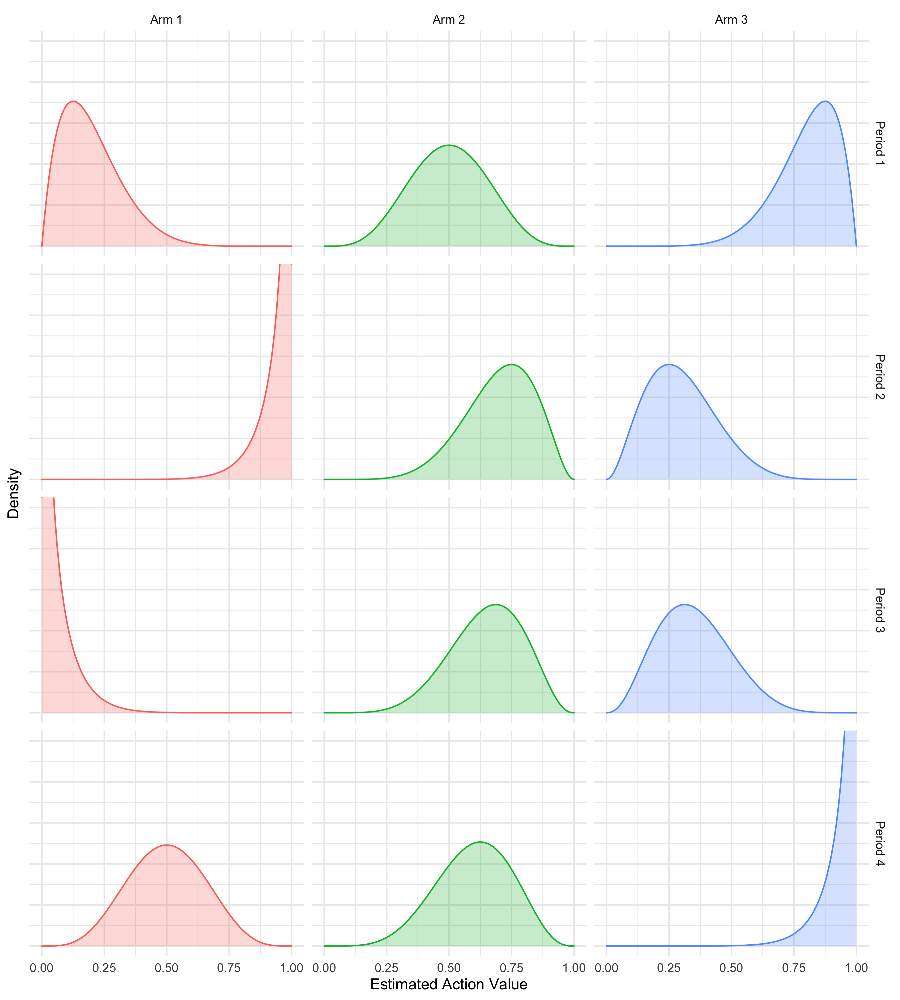

```{r setup, include=FALSE}
rm(list = ls())
knitr::opts_chunk$set(
  echo = FALSE, 
  fig.align = "center",
  out.width = 450
)
library(reticulate)
library(ggplot2)
theme_set(theme_bw())
library(data.table)
```

```{python setup-py}
# Libraries:
import numpy as np
import matplotlib.pyplot as plt
from tqdm import tqdm
from numpy import log
from numpy import random
from numpy import sqrt
from numpy import argmax
from numpy import zeros

# Functions:
from python.mab import *
from python.experiment import *
```


\pagebreak

# Introduction

The multi-armed bandit (MAB) is a problem in reinforcement learning that focuses on how to solve the exploration-exploitation dilemma [@sutton2018reinforcement]. Each of the arms has a probability of succeeding which is modelled by a Bernoulli distribution with a parameter $p$. Most of the theory around multi-armed bandits covered in class and its respective implementations assume stationary on the arms, that is, the probability of an arm succeeding does not change through time. However, in most real life settings, this strong assumption is not satisfied [@raj2017taming]. 

For instance, consider the problem deciding which news to put in the front page of a news paper that will capture the attention of as many readers as possible. In order to model the response of the reader to the news shown, one can use a Bernoulli distribution where the $p$ describes the probability that the user clicks on the news link. In the stationary setup, this probability is assumed to be constant, which is unrealistic: there are trends that lead to some articles being more popular during some period and less popular during other times. For instance, during the Eurocup, an article on football can be predicted to have a lot of clicks, however once the Eurocup is over and friendly games take over, an article on football might not be as interesting anymore and thus getting fewer clicks.

To this end, in this project we explore different strategies that have been proposed and tested in order to deal with the complication of non-stationarity. We compare the different strategies empirically. The remainder of this note is structured as follows: in section \@ref(strat) we briefly summarise a set of recent papers that have emerged from this line of literature. This will provide us with a set of difference strategies for solving non-stationary multi-armed bandits and serve as the foundation for an empirical investigation of their performance in section \@ref(emp). Finally, in section \@ref(dis) we discuss the empirical results and conclude.

# Strategies for solving non-stationary MABs {#strat}

```{python}
horizon = 10000
def bandits(t):
    # With this function we will create the true underlying 
    # probabilities for all the bandits 
    if t < 2000:
        vector_prob = [0.2,0.5,0.8]
    elif 2000 <= t <= 4999:
        vector_prob = [0.95,0.7,0.3]
    elif 5000 <= t <= 5999:
        vector_prob = [0.05,0.65,0.35]
    else:
        vector_prob = [0.5,0.6,0.95]
    return vector_prob

probs = np.asarray([bandits(t) for t in range(horizon)])
```

```{r unique-probs}
probs <- data.table(py$probs)
setnames(probs, names(probs), sprintf("arm_%i", 1:ncol(probs)))
bounds <- probs[,max(.I),by = paste(arm_1,arm_2,arm_3)]$V1
unique_probs <- unique(probs)
unique_probs[,period := 1:.N]
unique_probs[,bounds := bounds]
setcolorder(unique_probs, c("period","bounds"))

unique_probs_l <- melt(unique_probs, id.vars = c("period", "bounds"))
beta <- function(x, a, b) {
  numerator <- x^(a - 1) * (1 - x)^(b - 1)
  gamma_a <- factorial(a - 1)
  gamma_b <- factorial(b - 1)
  gamma_ab <- factorial(a + b - 1)
  denominator <- (gamma_a * gamma_b)/gamma_ab
  return(numerator/denominator)
}
posteriours <- unique_probs_l[
  ,
  .(
    x = seq(0,1,0.01),
    beta = beta(
      x = seq(0,1,0.01),
      a = value*10,
      b = (1 - value)*10
    )
  ),
  by = .(period,variable)
]
posteriours[,period := sprintf("Period %i",period)]
posteriours[,variable := stringr::str_to_title(gsub("_"," ",variable))]
```

Before diving into non-stationarity we briefly review a few of the conventional approaches that are used to solve stationary multi-armed bandits. Consider a multi-armed bandit with $K$ all of which yield rewards that are generated by a Bernoulli distribution. Let $\mathbf{p}$ denote the vector of constant (stationary) Bernoulli probabilities where element $p_k$, $k=1,...,K$ indicates the unconditional probability that arm $a_k$ yields a reward. Without loss of generality we will assume that rewards in period $t$ are binary: $\mathbf{r}_t=[0,1]^{K}$. When thinking about solving this stationary MAB, the goal is acquire good action value estimates $\hat{q}(a)$ for all $a_1,...,a_K$ and choose the optimal one.

In this stationary context, the idea of the MAB is quite simple: as the bandit repeatedly chooses actions and observes rewards it learns about the different action values, as long as it explores enough. In our case the true action value simply corresponds to its Bernoulli probablitiy. Figure \@ref(fig:period-1) shows a sketch of the learned posteriour distributions attached to three different arms with true action values `r knitr::combine_words(unique_probs_l[period==1]$value)`. The general idea underlying all strategies that aim to solve stationary MABs is that over time the bandit's uncertainty around the arms' action values decreases, provided it explores enough. Eventually then the bandit learns which is the optimal arm. Good strategies for solving stationary MABs adequately balance the trade-off between **exploring** and hence acquiring good action value estimates and **exploiting** arms with high estimated action values.

```{r, fig.height=3, fig.width=9, eval=FALSE}
theme_set(theme_minimal())
ggplot(data=posteriours[period=="Period 1"], aes(x=x, y=beta, fill=variable, colour=variable)) +
  geom_area(alpha=0.25, show.legend = FALSE) +
  facet_grid(
    cols=vars(variable),
    rows=vars(period)
  ) +
  labs(
    x="Estimated Action Value",
    y="Density"
  ) +
  theme(
    axis.text.y = element_blank(),
    axis.ticks.y = element_blank()
  )
ggsave("www/posteriour_period_1.png")
```

```{r, fig.height=10, fig.width=9, eval=FALSE}
ggplot(data=posteriours, aes(x=x, y=beta, fill=variable, colour=variable)) +
  geom_area(alpha=0.25, show.legend = FALSE) +
  facet_grid(
    cols=vars(variable),
    rows=vars(period)
  ) +
  labs(
    x="Estimated Action Value",
    y="Density"
  ) +
  coord_cartesian(ylim=c(0,5)) +
  theme(
    axis.text.y = element_blank(),
    axis.ticks.y = element_blank()
  )
ggsave("www/posteriour_period_all.png")
```

```{r period-1, fig.cap="Sketch of estimated action value distributions for stationary probabilites."}

```

Two of the simplest approaches to stationary MABs are referred to as $\epsilon$-first and $\epsilon$-greedy [@sutton2018reinforcement]. The former is intertemporal composition of a random and a deterministic choice: it imposes that up until a certain point in the sampling period arms are chosen at random and thereafte the arm with the highest estimated action value is chosen. In particular, let $\tilde{a}_t$ denote a random draw from $\{a_1,...,a_K\}$ in time period $t$ and let $T$ denote the total number of time periods. Then the $\epsilon$-first approach can be formally defined as follows:

\begin{equation}
a_t= \begin{cases}
 \tilde{a}_t \ \ \ \text{if } \frac{t}{T}<\epsilon \\
 \arg\max_{a}\hat{q}_t(a) \ \ \ \text{otherwise.}
\end{cases} \\
(\#eq:eps-first)
\end{equation}

The plain-vanilla $\epsilon$-greedy approach is similar in that it is also a composition of a random and a deterministic choice. Formally we have 

\begin{equation} 
\begin{aligned}
&& a_t&=\tilde{a}_tI_t + (1-I_t)\arg\max_{a}\hat{q}_t(a) \\
\end{aligned}
(\#eq:eps-greedy)
\end{equation}

where $I_t \sim \text{Bern}(\epsilon)$ determines in each period whether the random a deterministic choice is applied. Note that in contrast to $\epsilon$-first, the rule defined in \@ref(eq:eps-greedy) allows from exploration throughout the sampling period.

Another popular and simple choice for solving stationary MABs is **Softmax**.

\begin{equation} 
\begin{aligned}
&& P(a_t=a)&= \frac{\exp( \frac{\hat{q}_t(a)}{\tau})}{ \sum_{k=1}^{K}\frac{\hat{q}_t(a_k)}{\tau}) } \\
\end{aligned}
(\#eq:softmax)
\end{equation}

> **NOTE** Ignacio to complete

All of these simple approaches can perform very well in the context of stationary MABs, but cumulative regret is typically a linear function of time. Algorithms that achieve sub-linear regret work under the premise of **optimism in the fact of uncertainty**: they exploit uncertainty in that they typically favour choosing arms that the bandit is uncertain about. The most common approaches are **Upper Confidence Bounds** (UCB) and **Thompson Sampling**. They largely differ in their approach towards quantifying uncertainty.

The general UCB rule for choosing arms can be defined as

\begin{equation} 
\begin{aligned}
&& a_t&=\arg\max_a \left( \hat{q}_t(a)+\hat{U}_t(a) \right) \\
\end{aligned}
(\#eq:ucb)
\end{equation}

where the exact specification of the upper confidence bound $\hat{U}(\cdot)$ is at the researcher's discretion. Typical choices for the functional form of $\hat{U}(\cdot)$ decrease in $t$ and and the number of times $m_t$ that any given arm $a$ has already been observed, for example $\hat{U}_t(\hat{a})=\sqrt{ \frac{2 \log t}{m_t}}$ [@auer2002finite]. Another possible choice derived from Chernoff's bound and used in @chapelle2011empirical is $\hat{U}_t(\hat{a})= \frac{k_t}{m_t} + \sqrt{\frac{2 \frac{k_t}{m_t} \log \frac{1}{\delta}}{m_t}} + \frac{2\log \frac{1}{\delta}}{m_t}$ where $\delta=\sqrt{ \frac{1}{t}}$ and $k_t$ in our context denotes the number of times that any given arm has yielded a reward up until time period $t$.

Thompson Sampling instead takes a Bayesian approach towards quantifying uncertainty and has been shown to outperform UCB in the context of stationary multi-armed bandits [@chapelle2011empirical]. Formally we have for that

\begin{equation} 
\begin{aligned}
&& a_t&=\arg\max_a f_{\mathbf{w}}(a), && \mathbf{w}\sim P(\mathbf{w}|\alpha+n_{a,1},\beta+n_{a,0}) \\
\end{aligned}
(\#eq:thompson)
\end{equation}

where $P(\mathbf{w}|\alpha+n_{a,1},\beta+n_{a,0}) =\prod_{k=1}^K \text{Beta}(w_k|\alpha+n_{a,1},\beta+n_{a,0})$, $n_{a,1}$ here denotes the number of times arm $a$ has yielded a reward and $n_{a,0}$ denotes the number of times $a$ failed to yield a reward. The term $f_{\mathbf{w}}(a)$ just corresponds to the posteriour mean and hence the bandit's belief about the action value of arm $a$.

All of these strategies can in principal be used to solve the stationary Bernoulli MAB with the latter typically performing much better than the simple approaches we initially introduced. But it should by now be clear that the assumption of stationarity is crucial for these strategies to work well. Suppose now that instead of each arm having stationary reward probabilities these parameters change over time. In that case we would like to ensure that the bandit always has the capacity to update their beliefs about the action values. In particular, in a non-stationary or piece-wise stationary environment the bandit should be able to pick up on structural changes in the underyling probability distributions. 

Figure \@ref(fig:period-all) presents a sketch of action value distributions in a piece-wise stationary environment. Here we have imposted that in period 2 the true action values change to `r knitr::combine_words(unique_probs_l[period==2]$value)` from their initial values. In period 3 and 4 they change to `r knitr::combine_words(unique_probs_l[period==3]$value)` and `r knitr::combine_words(unique_probs_l[period==4]$value)`, respectively. The plotted distributions in Figure \@ref(fig:period-all) can best be thought of as describing posteriour beliefs of a bandit that has learned these distributions independently during the different time periods. Of course, this is the ideal scenario, but not realistic: in practice the bandit enters each new period with prior beliefs shaped during the previous period. For example, a bandit that has adequately explored during period 1 enters period 2 thinking that arm 3 is the optimal choice. At the beginning of period 2 that is no longer true: in fact, arm 3 is now a very poor choice. But this news is only gradually revealed to the bandit as it observes new rewards (or lack thereof if it continues to choose arm 3). A good bandit therefore needs to be capable to quickly unlearn their prior beliefs in light of the new information. 

```{r period-all, fig.cap="Sketch of estimated action value distributions for different periods. Bernoulli probabilities are assumed to be piece-wise stationary."}

```

Strategies designed to deal with non-stationary MABs incorporate these ideas. ...

> **NOTE**: All to complete

@raj2017taming - **Taming Non-stationary Bandits: A Bayesian Approach**
@besbes2014stochastic - **Stochastic multi-armed-bandit problem with non-stationary rewards**
@gupta2011thompson - **Thompson Sampling for Dynamic Multi-armed Bandits**
@garivier2008upper - **On upper-confidence bound policies for non-stationary bandit problems**

\FloatBarrier

# Empirical investigation {#emp}

```{r}
res <- readRDS("results/proj_emp_results.rds")
```

We now move on to comparing the different proposed methodologies. As the testing ground we will use the piece-wise stationary environment that we already introduced in the previous section. For reference, Table \@ref(tab:tab) summarises how the Bernoulli probability vary across the different time periods.

```{r}
res[,algo := as.factor(algo)]
levels(res$algo) <- c(
  "Thompson (discounted)",
  "UCB (discounted)",
  "epsilon-first",
  "Softmax",
  "Sliding Window",
  "Thompson",
  "UCB"
)
res[,t := 1:.N, by = algo]
```

Figure \@ref(fig:res) present the benchmark of the different strategies we introduced above for solving multi-armed bandits. 

```{r res, fig.cap="Benchmarking strategies for solving a piece-wise stationary Bernoulli multi-armed bandit.", fig.height=4, fig.width=7}
p <- ggplot(data = res, aes(x = t, y = cum_regret, colour = algo)) +
  scale_color_discrete(name = "Algorithm:") +
  geom_line() +
  labs(
    x = "Time",
    y = "Cumulative regret"
  )
p
```


```{r tab}
knitr::kable(
  unique_probs,
  col.names = c(
    "Period",
    "T",
    "Arm 1",
    "Arm 2",
    "Arm 3"
  ),
  caption = "A piece-wise stationary Bernoulli multi-armed bandit."
)
```

> **NOTE**: All to complete

\FloatBarrier

# Discussion {#dis}

> **NOTE**: All to complete

\FloatBarrier
\pagebreak

# References {-}

<div id="refs"></div>


