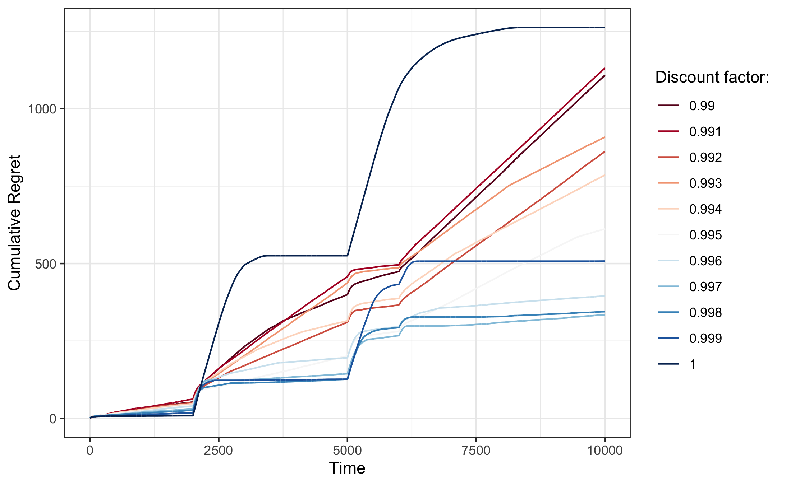

```{r setup, include=FALSE}
rm(list = ls())
knitr::opts_chunk$set(
  echo = FALSE, 
  fig.align = "center",
  out.width = 450
)
library(reticulate)
library(ggplot2)
theme_set(theme_bw())
library(data.table)
lapply(
  list.files("R", pattern = "\\.R"),
  function(file) {
    source(file = file.path("R",file))
  }
)
```

```{python setup-py}
# Libraries:
import numpy as np
import matplotlib.pyplot as plt
from tqdm import tqdm
from numpy import log
from numpy import random
from numpy import sqrt
from numpy import argmax
from numpy import zeros

# Functions:
from python.mab import *
from python.experiment import *
```


\pagebreak

# Introduction

The multi-armed bandit (MAB) is a problem in reinforcement learning that focuses on how to solve the exploration-exploitation dilemma [@sutton2018reinforcement]. Each of the arms has a probability of succeeding which is modelled by a Bernoulli distribution with a parameter $p$. Most of the theory around multi-armed bandits covered in class and its respective implementations assume stationary on the arms, that is, the probability of an arm succeeding does not change through time. However, in most real life settings, this strong assumption is not satisfied [@raj2017taming]. 

For instance, consider the problem deciding which news to put in the front page of a news paper that will capture the attention of as many readers as possible. In order to model the response of the reader to the news shown, one can use a Bernoulli distribution where the $p$ describes the probability that the user clicks on the news link. In the stationary setup, this probability is assumed to be constant, which is unrealistic: there are trends that lead to some articles being more popular during some period and less popular during other times. For instance, during the Eurocup, an article on football can be predicted to have a lot of clicks, however once the Eurocup is over and friendly games take over, an article on football might not be as interesting anymore and thus getting fewer clicks.

To this end, in this project we explore different strategies that have been proposed and tested in order to deal with the complication of non-stationarity. We compare the different strategies empirically. The remainder of this note is structured as follows: in section \@ref(strat) we briefly summarise a set of recent papers that have emerged from this line of literature. This will provide us with a set of difference strategies for solving non-stationary multi-armed bandits and serve as the foundation for an empirical investigation of their performance in section \@ref(emp). Finally, in section \@ref(dis) we discuss the empirical results and conclude.

# Strategies for solving non-stationary MABs {#strat}

```{python}
horizon = 10000
def bandits(t):
    # With this function we will create the true underlying 
    # probabilities for all the bandits 
    if t < 2000:
        vector_prob = [0.2,0.5,0.8]
    elif 2000 <= t <= 4999:
        vector_prob = [0.95,0.7,0.3]
    elif 5000 <= t <= 5999:
        vector_prob = [0.05,0.65,0.35]
    else:
        vector_prob = [0.5,0.6,0.95]
    return vector_prob

probs = np.asarray([bandits(t) for t in range(horizon)])
```

```{r unique-probs}
probs <- data.table(py$probs)
setnames(probs, names(probs), sprintf("arm_%i", 1:ncol(probs)))
bounds <- probs[,max(.I),by = paste(arm_1,arm_2,arm_3)]$V1
unique_probs <- unique(probs)
unique_probs[,period := 1:.N]
unique_probs[,bounds := bounds]
setcolorder(unique_probs, c("period","bounds"))

unique_probs_l <- melt(unique_probs, id.vars = c("period", "bounds"))
beta <- function(x, a, b) {
  numerator <- x^(a - 1) * (1 - x)^(b - 1)
  gamma_a <- factorial(a - 1)
  gamma_b <- factorial(b - 1)
  gamma_ab <- factorial(a + b - 1)
  denominator <- (gamma_a * gamma_b)/gamma_ab
  return(numerator/denominator)
}
posteriours <- unique_probs_l[
  ,
  .(
    x = seq(0,1,0.01),
    beta = beta(
      x = seq(0,1,0.01),
      a = value*10,
      b = (1 - value)*10
    )
  ),
  by = .(period,variable)
]
posteriours[,period := sprintf("Period %i",period)]
posteriours[,variable := stringr::str_to_title(gsub("_"," ",variable))]
```

Before diving into non-stationarity we briefly review a few of the conventional approaches that are used to solve stationary multi-armed bandits. Consider a multi-armed bandit with $K$ all of which yield rewards that are generated by a Bernoulli distribution. Let $\mathbf{p}$ denote the vector of constant (stationary) Bernoulli probabilities where element $p_k$, $k=1,...,K$ indicates the unconditional probability that arm $a_k$ yields a reward. Without loss of generality we will assume that rewards in period $t$ are binary: $\mathbf{r}_t=[0,1]^{K}$. When thinking about solving this stationary MAB, the goal is acquire good action value estimates $\hat{q}(a)$ for all $a_1,...,a_K$ and choose the optimal one.

In this stationary context, the idea of the MAB is quite simple: as the bandit repeatedly chooses actions and observes rewards it learns about the different action values, as long as it explores enough. In our case the true action value simply corresponds to its Bernoulli probablitiy. Figure \@ref(fig:period-1) shows a sketch of the learned posteriour distributions attached to three different arms with true action values `r knitr::combine_words(unique_probs_l[period==1]$value)`. The general idea underlying all strategies that aim to solve stationary MABs is that over time the bandit's uncertainty around the arms' action values decreases, provided it explores enough. Eventually then the bandit learns which is the optimal arm. Good strategies for solving stationary MABs adequately balance the trade-off between **exploring** and hence acquiring good action value estimates and **exploiting** arms with high estimated action values.

```{r, fig.height=3, fig.width=9, eval=FALSE}
theme_set(theme_minimal())
ggplot(data=posteriours[period=="Period 1"], aes(x=x, y=beta, fill=variable, colour=variable)) +
  geom_area(alpha=0.25, show.legend = FALSE) +
  facet_grid(
    cols=vars(variable),
    rows=vars(period)
  ) +
  labs(
    x="Estimated Action Value",
    y="Density"
  ) +
  theme(
    axis.text.y = element_blank(),
    axis.ticks.y = element_blank()
  )
ggsave("www/posteriour_period_1.png")
```

```{r, fig.height=10, fig.width=9, eval=FALSE}
ggplot(data=posteriours, aes(x=x, y=beta, fill=variable, colour=variable)) +
  geom_area(alpha=0.25, show.legend = FALSE) +
  facet_grid(
    cols=vars(variable),
    rows=vars(period)
  ) +
  labs(
    x="Estimated Action Value",
    y="Density"
  ) +
  coord_cartesian(ylim=c(0,5)) +
  theme(
    axis.text.y = element_blank(),
    axis.ticks.y = element_blank()
  )
ggsave("www/posteriour_period_all.png")
```

```{r period-1, fig.cap="Sketch of estimated action value distributions for stationary probabilites."}
knitr::include_graphics("www/posteriour_period_1.png")
```

Two of the simplest approaches to stationary MABs are referred to as $\epsilon$-first and $\epsilon$-greedy [@sutton2018reinforcement]. The former is intertemporal composition of a random and a deterministic choice: it imposes that up until a certain point in the sampling period arms are chosen at random and thereafte the arm with the highest estimated action value is chosen. In particular, let $\tilde{a}_t$ denote a random draw from $\{a_1,...,a_K\}$ in time period $t$ and let $T$ denote the total number of time periods. Then the $\epsilon$-first approach can be formally defined as follows:

\begin{equation}
a_t= \begin{cases}
 \tilde{a}_t \ \ \ \text{if } \frac{t}{T}<\epsilon \\
 \arg\max_{a}\hat{q}_t(a) \ \ \ \text{otherwise.}
\end{cases} \\
(\#eq:eps-first)
\end{equation}

The plain-vanilla $\epsilon$-greedy approach is similar in that it is also a composition of a random and a deterministic choice. Formally we have 

\begin{equation} 
\begin{aligned}
&& a_t&=\tilde{a}_tI_t + (1-I_t)\arg\max_{a}\hat{q}_t(a) \\
\end{aligned}
(\#eq:eps-greedy)
\end{equation}

where $I_t \sim \text{Bern}(\epsilon)$ determines in each period whether the random a deterministic choice is applied. Note that in contrast to $\epsilon$-first, the rule defined in \@ref(eq:eps-greedy) allows from exploration throughout the sampling period.

Another popular and simple choice for solving stationary MABs is **Softmax**.

\begin{equation} 
\begin{aligned}
&& P(a_t=a)&= \frac{\exp( \frac{\hat{q}_t(a)}{\tau})}{ \sum_{k=1}^{K}\frac{\hat{q}_t(a_k)}{\tau}) } \\
\end{aligned}
(\#eq:softmax)
\end{equation}

The idea of softmax is very intuitive: the arm is chosen each period according to a probably distribution. This probabilty distribution gives more weight to arms that have been performing well. In this case we also allow for exploration throughout the sample.

All of these simple approaches can perform very well in the context of stationary MABs, but cumulative regret is typically a linear function of time. Algorithms that achieve sub-linear regret work under the premise of **optimism in the fact of uncertainty**: they exploit uncertainty in that they typically favour choosing arms that the bandit is uncertain about. The most common approaches are **Upper Confidence Bounds** (UCB) and **Thompson Sampling**. They largely differ in their approach towards quantifying uncertainty.

The general UCB rule for choosing arms can be defined as

\begin{equation} 
\begin{aligned}
&& a_t&=\arg\max_a \left( \hat{q}_t(a)+\hat{U}_t(a) \right) \\
\end{aligned}
(\#eq:ucb)
\end{equation}

where the exact specification of the upper confidence bound $\hat{U}(\cdot)$ is at the researcher's discretion. Typical choices for the functional form of $\hat{U}(\cdot)$ decrease in $t$ and and the number of times $m_t$ that any given arm $a$ has already been observed, for example $\hat{U}_t(\hat{a})=\sqrt{ \frac{2 \log t}{m_t}}$ [@auer2002finite]. Another possible choice derived from Chernoff's bound and used in @chapelle2011empirical is $\hat{U}_t(\hat{a})= \frac{k_t}{m_t} + \sqrt{\frac{2 \frac{k_t}{m_t} \log \frac{1}{\delta}}{m_t}} + \frac{2\log \frac{1}{\delta}}{m_t}$ where $\delta=\sqrt{ \frac{1}{t}}$ and $k_t$ in our context denotes the number of times that any given arm has yielded a reward up until time period $t$.

Thompson Sampling instead takes a Bayesian approach towards quantifying uncertainty and has been shown to outperform UCB in the context of stationary multi-armed bandits [@chapelle2011empirical]. Formally we have for that

\begin{equation} 
\begin{aligned}
&& a_t&=\arg\max_a f_{\mathbf{w}}(a), && \mathbf{w}\sim P(\mathbf{w}|\alpha+n_{a,1},\beta+n_{a,0}) \\
\end{aligned}
(\#eq:thompson)
\end{equation}

where $P(\mathbf{w}|\alpha+n_{a,1},\beta+n_{a,0}) =\prod_{k=1}^K \text{Beta}(w_k|\alpha+n_{a,1},\beta+n_{a,0})$, $n_{a,1}$ here denotes the number of times arm $a$ has yielded a reward and $n_{a,0}$ denotes the number of times $a$ failed to yield a reward. The term $f_{\mathbf{w}}(a)$ just corresponds to the posteriour mean and hence the bandit's belief about the action value of arm $a$.

All of these strategies can in principal be used to solve the stationary Bernoulli MAB with the latter typically performing much better than the simple approaches we initially introduced. But it should by now be clear that the assumption of stationarity is crucial for these strategies to work well. Suppose now that instead of each arm having stationary reward probabilities these parameters change over time. In that case we would like to ensure that the bandit always has the capacity to update their beliefs about the action values. In particular, in a non-stationary or piece-wise stationary environment the bandit should be able to pick up on structural changes in the underyling probability distributions. 

Figure \@ref(fig:period-all) presents a sketch of action value distributions in a piece-wise stationary environment. Here we have imposted that in period 2 the true action values change to `r knitr::combine_words(unique_probs_l[period==2]$value)` from their initial values. In period 3 and 4 they change to `r knitr::combine_words(unique_probs_l[period==3]$value)` and `r knitr::combine_words(unique_probs_l[period==4]$value)`, respectively. The plotted distributions in Figure \@ref(fig:period-all) can best be thought of as describing posteriour beliefs of a bandit that has learned these distributions independently during the different time periods. Of course, this is the ideal scenario, but not realistic: in practice the bandit enters each new period with prior beliefs shaped during the previous period. For example, a bandit that has adequately explored during period 1 enters period 2 thinking that arm 3 is the optimal choice. At the beginning of period 2 that is no longer true: in fact, arm 3 is now a very poor choice. But this news is only gradually revealed to the bandit as it observes new rewards (or lack thereof if it continues to choose arm 3). A good bandit therefore needs to be capable to quickly unlearn their prior beliefs in light of the new information. 

```{r period-all, fig.cap="Sketch of estimated action value distributions for different periods. Bernoulli probabilities are assumed to be piece-wise stationary."}
knitr::include_graphics("www/posteriour_period_all.png")
```

Strategies designed to deal with non-stationary MABs incorporate these ideas. In particular, these strategies are mainly based on modifications of the aforementioned algorithms. The following two subsections discuss two interesting approaches and present the underyling methodology.

## Discounted Thompson Sampling {#thom_sam}

We have based the evaluation of the Discounted Thompson Sampling (DTS) on @raj2017taming. The key idea of DTS is to systematically increase the variance of the prior distributions maintained for unexplored arms. Formally, we have that 

\begin{equation} 
\begin{aligned}
&& a_t&=\arg\max_a f_{\mathbf{w}}(a), && \mathbf{w}\sim P(\mathbf{w}|\alpha+n_{a,1},\beta+n_{a,0}) \\
\end{aligned}
(\#eq:thompson)
\end{equation}

where $P(\mathbf{w}|\alpha+n_{a,1},\beta+n_{a,0}) =\prod_{k=1}^K \text{Beta}(w_k|\alpha+n_{a,1},\beta+n_{a,0})$

like for standard Thomspon Sampling. The main difference lies in the updating rule for the number of successes and the number of failures. Now, for each iteration we will update these two values in the following way:

$$n_{a^{*},1} \leftarrow \gamma n_{a^{*},1} + r_{t}$$

$$n_{a^{*},0} \leftarrow \gamma n_{a^{*},0} + (1-r_{t})$$

where $a^{*}$ is the action chosen in iteration $t$, $\gamma \in (0,1)$ is a discount factor, and 

$$n_{a,1} \leftarrow \gamma n_{a,1}$$

$$n_{a,0} \leftarrow \gamma n_{a,0}$$

for all other actions. Therefore, as we can see, when sampling the posterior, we know incorporate a discount factor, which implies that observations far away in time have a lower weight than the most recent observations, so DTS works by discounting the effect of past observations. The algorithm updates parameters of all posterior distributions at every timestep. By increasing the variance of all arms, the probability of picking past inferior arms for exploration increases. However, by keeping the mean almost constant, the algorithm will not pick inferior arms too often. 

## Discounted Upper Confidence Bound

As stressed in @hartland2006multi empirical evidence shows that UCB's exploration vs exploitation trade off is not appropriate for non-stationary for abruptly changing environments. To address this problem, @garivier2008upper proposes the discounted UCB (DUCB). In order to estimate the expected reward, the DUCB policy averages past rewards with a discount factor giving more weight to recent observations, in line with the approach followed by DTS. This policy constructs an UCB $\bar X_{t}(\gamma,i) + c_{t}(\gamma,i)$ for the expected reward, where the discounted average is given by

$$ \bar X_{t}(\gamma,i) = \frac{1}{N_{t}(\gamma,i)}\sum_{s=1}^{t}\gamma^{t-s}X_{s}(i)\mathbb{I}_{a_{s} = i}$$

where $X_{s}(i)$ is the reward obtained by arm $i$ at timestep $s$, and where

$$ N_{t}(\gamma,i) = \sum_{s=1}^{t}\gamma^{t-s}\mathbb{I}_{a_{s} = i} $$ 

and the discounted padding function is defined as 

$$ c_{t}(\gamma,i) = 2B\sqrt{\frac{\xi log(n_{t})}{N_{t}(\gamma,i)}}$$

and $n_{t} = \sum_{i=1}^{K}N_{t}(\gamma,i)$. First of all, note that for $\gamma = 1$, you get standard UCB. However, the main contribution of @garivier2008upper is the Sliding-Window UCB. They propose a methodology where instead of averaging the rewards over all past with a discount factor they use a local empirical average of the observed rewards, by using only the $\tau$ last plays. Specifically, this algorithm constructs an UCB $\bar X_{t}(\tau,i) + c_{t}(\tau,i)$ where the local empirical average is given by

$$ \bar X_{t}(\tau,i) = \frac{1}{N_{t}(\tau,i)}\sum_{s=t-\tau +1}^{t}\gamma^{t-s}X_{s}(i)\mathbb{I}_{a_{s} = i}$$
and the padding function is defined as 

$$c_{t}(\tau,i) = 2B\sqrt{\frac{\xi log(min(t,\tau))}{N_{t}(\gamma,i)}}$$

\FloatBarrier

# Empirical investigation {#emp}

```{r}
res <- readRDS("results/proj_emp_results.rds")
```

```{r}
res[,algo := as.factor(algo)]
levels(res$algo) <- c(
  "Thompson (discounted)",
  "UCB (discounted)",
  "epsilon-first",
  "epsilon-greedy",
  "Softmax",
  "Sliding Window",
  "Thompson",
  "UCB"
)
res[,t := 1:.N, by = algo]
```

We now move on to comparing the different proposed methodologies. As the testing ground we will use the piece-wise stationary environment that we already introduced in the previous section. 

In Figure \@ref(fig:res) we can observe the performance of the different sampling methods described in the previous sections. The first thing we notice is that the sampling methods that incorporate a discounting factor yield the best performance in the non-stationary setting as expected. As noted above, the introduction of a discount factor implements the premise that realizations that lie far in the past should be weighted less when updated beliefs about action values. Or in other words, recent information has more relevance when estimating the expected reward of any given arm. Both Discounted UCB and Discounted Thompson appear to quickly pick up on the change in the underlying Bernoulli distribution and therefore acummuluate less regret during these sample periods than conventional UCB and Thompson. The Sliding Window approach is very similar to the discounted UCB approach, which is reflected in its similar performance.

When looking at the conventional UCB more closely we can observe that it is overall the best sampling method during the first half of the sample period. When the first structural change happens, it reacts relatively swiftly but initially incurs a steep increase in cumulative regret. The same is observed for Thompson Sampling, though it is slower to react to the changes and therefore performs worse. In the third period we see something interesting: we can see that UCB is much slower to react to the probability changes. This is likely due to the fact that in this periods all the arms have a similar probability of reward. It therefore takes longer to gain certainty about the action values. Consistent with that logic, the final change in probabilities clearly favours one particular arm and as consequence even the conventional sampling methods accumulate only little regret.

As mentioned in previous sections, conventional Thompson sampling tends to perform better than conventional UCB in a stationary setting, but as evident from the results here this is no longer the case in the non-stationary setting. If past beliefs are not discounted, then the Bayesian way for sampling arms does not appear to provide the necessary flexibility to unlearn prior beliefs. On the other hand, our implementation of the UCB adapts much better to changes in the distribution and therefore achieves better cumulative regret in the non-stationary setting.

Finally, softmax, $\epsilon$-first and $\epsilon$-greedy do very poorly as one would have expected. In the case of softmax, we can see that choosing the arm with respect to probabilities that are proportional to the mean rewards also does not achieves a good performance. The simple $\epsilon$-first only explores during the pure exploration phase and is therefore completely insensitive to structural changes that occur during the pure exploitation period. Performance for $\epsilon$-greedy is marginally better, likely due to the fact that it randomly explores throughout the entire sample period.

```{r res, fig.cap="Benchmarking strategies for solving a piece-wise stationary Bernoulli multi-armed bandit.", fig.height=4, fig.width=7}
p <- ggplot(data = res, aes(x = t, y = cum_regret, colour = algo)) +
  scale_color_discrete(name = "Algorithm:") +
  geom_line() +
  labs(
    x = "Time",
    y = "Cumulative regret"
  )
p
```

\FloatBarrier

## Discounted Thompson Sampling {#disc}

```{r}
delta <- 0.995
n_sim <- 100
```


Now that we have seen some preliminary evidence in favour of discounted sampling methods for non-stationary multi-armed bandits, in this section we will investigate the empirical performance of discounted Thompson Sampling (DTS) a little further. To this end we have implemented the algorithm in `C++` for greater computational efficiency. 

As a first exercise, we repeatedly apply DTS for subperiods of the sample and inspect the posteriour distributions for the action values. In particular, we train the TDS bandit independently on the first period only ($T_1=`r bounds[1]`$), then until the end of the second period ($T_2=`r bounds[2]`$), then until the end of the third period ($T_3=`r bounds[3]`$) and finally over the entire sample ($T_4=`r bounds[4]`$). We do this `r n_sim` times and each time return the discounted number of successes and failures. Average discounted counts across all `r n_sim` simulations then serve as our input for the Beta distribution, from which we draw repeatedly in order to obtain an empirical distribution for the posterior.

Since DTS has been shown to perform well, we expect that the shapes of the resulting distributions should be broadly consistent with the distributions we sketched above in Figure \@ref(fig:period-all). The results are shown in Figure \@ref(fig:period-ts) in the appendix. Indeed, they look very similar to the sketched distributions which were based on the true underlying Bernoulli probabilities. In other words, the DTS bandit appears to be capable of forming posteriour beliefs that are very much in line with reality, even though after each structural break it first has to unlearn its prior beliefs.

Finally, recall that the discount factor $\gamma$ involved in DTS is a free parameter. To the best of our knowledge, no guiding principles have been proposed in order to choose optimal values, although this would be an interesting theoretical question. Instead, the discount factor needs to be optimized through cross-validation. To this end, Figure \@ref(fig:disc) in the appendix shows how the cumulative regret varies with the discount factor. Upon visual inspection it appears that a value close to $0.997$ is optimal in this particular context. A choice of $1$ corresponds to the non-discounted Thompson Sampler and yield poor results. But performance also tends to decrease for choices lower than $0.997$, demonstrating the need for tuning.

# Conclusion {#dis}

In this short note we have explored how non-stationarity affects the sampling methods seen in class and other popular methods in the literature to choose actions in the context of MABs. We have explored the performance of $\epsilon$-first, $\epsilon$-greedy, softmax, UCB, Sliding Window UCB, Discounted UCB, Thompson Sampling and Discounted Thompson Sampling.

We provide empirical evidence demonstrating that methods that allow to give more relevance to present samples as opposed to samples from far in the past by including a discount factor perform very well in the non-sationary setting. On the other hand, those methods that fail to take non-stationarity into account unsurprisingly yield poor results. Among all sampling methods tested here, the one that achieves the best performance is Discounted Thompson Sampling (DTS). We have illustrated that DTS is capable of learning adequate posterior beliefs about action values even as it involves unlearning prior beliefs. Finally, we have also shown that the choice of the discount factor matters and practitioners should therefore carefully tune it.

\FloatBarrier
\pagebreak

# References {-}

<div id="refs"></div>

\FloatBarrier
\pagebreak

# (APPENDIX) Appendix {-}

# Additional Figures

```{r period-ts, fig.cap="Empirical distribution of estimated action values for different periods and corresponding piece-wise stationary probabilites.", out.width=400}
knitr::include_graphics("www/posteriour_ts.png")
```   

```{r disc, fig.cap="The effect of the discount factor on cumulative regret.", out.width=400}

```
