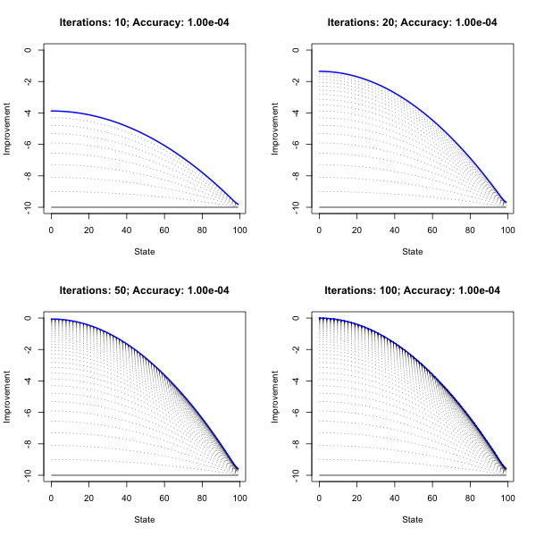
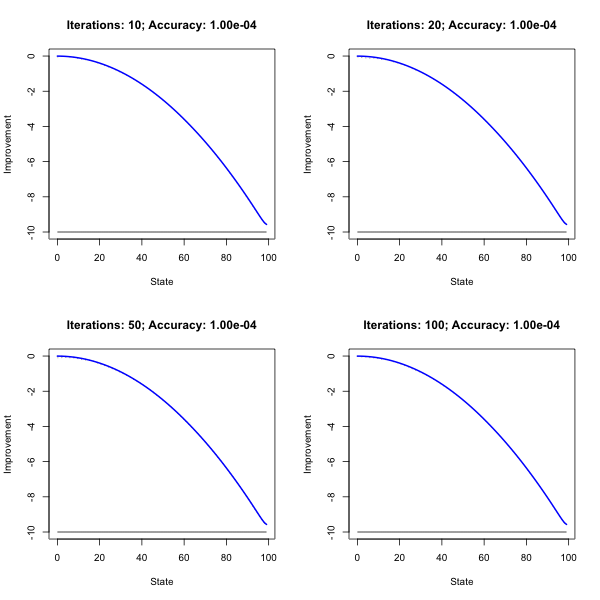

```{r setup, include=FALSE}
rm(list=ls())
knitr::opts_chunk$set(echo = FALSE, fig.align = "center", out.width = 500)
library(data.table)
library(ggplot2)
library(scales)
library(microbenchmark)
lapply(
  list.files("R", pattern = "\\.R"),
  function(file) {
    source(file = file.path("R",file))
  }
)
rand_seed <- 123
theme_set(theme_bw())
```

# Policy evaluation

The first thing to do is to define the Markov Decision Process (MDP). It is useful to implement the MDP as its own class and the different functions and algorithms as its corresponding methods. The [mdp.R](R/mdp.R) script contains the code that implements all of this. To inspect the code, either open the script directly or instead inspect the companion [code report](R/mdp.html). The code chunk below defines the parameters and then eventually uses them to define the MDP.

```{r, echo=TRUE}
N <- 100
# State space:
state_space <- seq(0,N-1,by=1)
# Action space:
action_space <- c(0.51, 0.6)
# Reward function:
reward_fun <- function(state, action, state_space) {
  reward <-  (-1) * ((state/max(state_space+1))^2 + ifelse(action==0.51,0,0.01))
}
# Transition function:
transition_fun <- function(new_state,state,action, p) {
  
  # Standard rule:
  state_diff <- data.table(new_state = new_state, state = state, q=action)
  state_diff[,diff:=new_state-state]
  state_diff[,prob:=0] # initialize all as zero
  state_diff[diff==1,prob:=p*(1-q)]
  state_diff[diff==0,prob:=p*q + (1-p)*(1-q)]
  state_diff[diff==-1,prob:=(1-p)*q]
  
  # Boundary cases:
  state_diff[state==min(state) & new_state==min(state),prob:=1 - p * (1-q)]
  state_diff[state==max(state) & new_state==max(state),prob:=1 - (1-p) * q]
  
  return(state_diff$prob)
}
# Discount factor:
discount_factor <- .9
# Additional arguments:
p <- 0.5
# Define the MDP:
mdp <- define_mdp(
  state_space = state_space,
  action_space = action_space,
  reward_fun = reward_fun,
  transition_fun = transition_fun,
  discount_factor = discount_factor,
  p=p
)
```

The following to chunks first define our two policies (lazy and aggressive), then they apply the policies and finally evaluate them using the closed-form solution for the limit of the power iteration. Figure \@ref(fig:lazy-aggr) plots the difference between the value of the lazy and the aggressive policy. Evidently, the lazy policy outperforms the aggressive policy for states around 50-60, but then loses significantly for later states around 70-90 up until the terminal state. This is intuitive: for long queue lengths it should pay off to take high action, but due to the associated cost there a risk of overshooting when taking the high action to early. This is exactly what happens in the range 50-60. It also only pays off to take high action until the terminal state, where the length cannot increase any more anyway, so incurring the cost will never lead to higher reward.

```{r, echo=TRUE}
# Policies:
lazy <- function(state, action_space) {
  action <- rep(action_space[1], length(state))
  return(action)
}

aggressive <- function(state, action_space) {
  action <- ifelse(state<50, action_space[1], action_space[2])
  return(action)
}
```

```{r, echo=TRUE}
# Lazy:
policy_lazy <- lazy(state = mdp$state_space, action_space = mdp$action_space)
V_pi_lazy <- evaluate_policy(mdp, policy = policy_lazy)
# Aggressive:
policy_aggr <- aggressive(state = mdp$state_space, action_space = mdp$action_space)
V_pi_aggr <- evaluate_policy(mdp, policy = policy_aggr)
```

```{r, eval=FALSE}
valuations <- data.table(state=state_space, lazy=V_pi_lazy, aggr=V_pi_aggr)
dt_plot <- melt(valuations, id.vars = "state")
ggplot(dt_plot, aes(x=state, y=value, colour=variable)) +
  geom_hline(aes(yintercept = 0), size=0.25) +
  geom_line() +
  labs(
    x="State",
    y="Value"
  )
```

```{r lazy-aggr, fig.cap="Comparison of lazy and aggressive policy."}
dt_plot <- data.table(state=1:length(state_space), value=V_pi_lazy-V_pi_aggr)
ggplot(dt_plot, aes(x=state, y=value)) +
  geom_line() +
  geom_hline(aes(yintercept = 0), size=0.25) +
  labs(
    x="State",
    y="Difference"
  )
```

\FloatBarrier
\pagebreak

# Value Iteration and Policy Iteration

Now we will estimate the optimal policy both through Value Iteration and Policy Iteration. The key steps of **Value Iteration** involve the following

```{r, eval=FALSE, echo=TRUE}
# 1.) Value function:
V_new <- policy_improvement(mdp, V, output_type = "value")

# 2.) Observe and update:
delta <- min(delta, max(abs(V_new-V)))
V <- V_new
iter <- iter + 1
finished <- (delta < accuracy) | (iter == max_iter)
```

where `accuracy` defines how accurate we want the estimation to be as in @sutton2018reinforcement. Note that Value Iteration (VI) does not involve a full evaluation sweep at each iteration. Conversely, evaluation forms one of the key steps of **Policy Iteration** which are as follows

```{r, eval=FALSE, echo=TRUE}
# 1.) Policy evaluation:
V <- power_iteration(mdp, policy, V, accuracy = accuracy)

# 2.) Policy improvement:
policy_proposed <- policy_improvement(mdp, V)

# 3.) Check if stable:
policy_stable <- policy == policy_proposed
iter <- iter + 1
finished <- all(policy_stable) | iter == max_iter
```

where as in @sutton2018reinforcement convergence is reached when the policy is unchanged (stable) from one iteration to the next. As mentioned above the full code can be inspected in the corresponding [report](R/mdp.html).

> NOTE: I follow @sutton2018reinforcement as closely as possible. An alternative approach would be to simply run iterate $N$ times and not use accuracy and stability as convergence criteria. In that case one would use only one power iteration to evaluate the policy in PI and iterate exactly $N$ times through the different sweeps in both PI and VI. This approach will also eventually converge to the optimal policy and value function. It may be closer aligned to the one in the slides. The code I put together here can be easily adapted to instead use that approach.

```{r}
max_iter <- c(10,20,50,100)
accuracy <- 1e-4
```

```{r, eval=FALSE, include=F}
# Value Iteration
png("www/value_iteration.png", width = 600, height = 600)
par(mfrow=rep(sqrt(length(max_iter)),2))
value_iter_results <- list()
for (i in 1:length(max_iter)) {
  value_iter_results[[i]] <- value_iteration(
    mdp = mdp,
    max_iter = max_iter[i],
    verbose = 1, # to produce plot
    accuracy = accuracy
  )
}
saveRDS(value_iter_results, file="results/value_iter.rds")
dev.off()
```

```{r, eval=FALSE, include=FALSE}
# Policy Iteration:
png("www/policy_iteration.png", width = 600, height = 600)
par(mfrow=rep(sqrt(length(max_iter)),2))
policy_iter_results <- list()
for (i in 1:length(max_iter)) {
  policy_iter_results[[i]] <- policy_iteration(
    mdp = mdp,
    max_iter = max_iter[i],
    verbose = 1, # to produce plot 
    accuracy = accuracy
  )
}
saveRDS(policy_iter_results, file="results/policy_iter.rds")
dev.off()
```

```{r}
value_iter_results <- readRDS("results/value_iter.rds")
val_it <- value_iter_results[[4]]
policy_iter_results <- readRDS("results/policy_iter.rds")
pol_it <- policy_iter_results[[4]]
```

Figures \@ref(fig:val-it) and \@ref(fig:pol-it) show the results of running Value and Policy Iteration, respectively, for different numbers of iterations. Figure \@ref(fig:val-it) illustrates nicely how VI gradually learns the optimal policy. It appears that for a desired accuracy of `r accuracy` VI finds a close-to-optimal policy and corresponding value function after 50 iterations. An inspection of the results showed that convergence with respect to the accuracy criterion was reached after 90 iterations (see Table \@ref(tab:num-iter)).

The optimal policy and corresponding value function returned by VI corresponds exactly to the one returned by Policy Iteration (PI). But note that with PI convergence is reached even when the maximum number if iterations is set to 10, so all panels in Figure \@ref(fig:pol-it) look similar. In general, Policy Iteration needs only for 3 to 4 iterations to converge (Table  \@ref(tab:num-iter)). The variation of the numbers largely varies because the initial policy is random and depending on how good a bad the initial guess is, it may take one iteration less or more to converge. 

While PI clearly takes less iterations than VI to reach convergence, this comes at a cost: evaluating the policy at each step through power iteration with the desired level of accuracy is computationally costly. Consequently the computational run times of the two different methods are not as much in favour of PI as one might have expected (Figure \@ref(fig:mb)).^[I found that simply using the closed-form solution at led to a massive reduction in run time for PI.]

With respect to the estimated optimal policy Figure \@ref(fig:policy) plots the actual choices for each state and Figure \@ref(fig:comparison) demonstrates the associated improvement in value compared to the lazy and aggressive policies investigated above. The results are very intuitive:

1. The lazy policy can be improved mainly around states 60-90, when it pays off to choose high action in light of the long queue.

2. The aggressive policy can be improved by avoiding to overshoot (states 50-60) and avoiding the wasteful effort in the terminal state.

These two points correspond to what the estimated optimal policy prescribes and therefore yield to improvement in value.

Finally another note on initial values: above the value function was initialised as -10 across as states. This is not necessary as Figure \@ref(fig:rand) illustrates. Here the initial values were drawn from a Gaussian distribution with mean -10.

```{r val-it, fig.cap="Value Iteration with 10, 20, 50 and 100 iterations. The blue line represents the value function corresponding to the final estimate of the optimal value function."}

```

```{r pol-it, fig.cap="Policy Iteration with 10, 20, 50 and 100 iterations. The blue line represents the value function corresponding to the final estimate of the optimal value function."}

```

```{r num-iter}
num_iter <- data.table(
  value_iter = sapply(value_iter_results, function(i) i$converged_after),
  policy_iter = sapply(policy_iter_results, function(i) i$converged_after)
)
knitr::kable(
  num_iter, 
  col.names = c("Value Iteration", "Policy Iteration"),
  caption = "Number of iterations until convergence or timeout is reached."
)
```

```{r, eval=FALSE}
mb <- microbenchmark(
  val_it = value_iteration(mdp, accuracy = 1e-3, max_iter = 100),
  pol_it = policy_iteration(mdp, accuracy = 1e-3, max_iter = 100)
)
saveRDS(mb, file="results/mb_iter.rds")
```

```{r mb, message=FALSE, fig.cap="Microbenchmark of computational times for Value Iteration and Policy Iteration."}
mb <- readRDS(file="results/mb_iter.rds")
autoplot(mb)
```

```{r policy, fig.cap="The estimated optimal policy."}
plot(
  x=mdp$state_space, 
  y=val_it$policy, 
  pch=1,
  cex=0.25,
  col="blue",
  xlab="State",
  ylab="Q"
)
```


```{r comparison, fig.height=3, fig.width=7, fig.cap="Improvement of estimated optimal policy compared to lazy and aggressive policy."}
par(mfrow=c(1,2))
plot(
  x=mdp$state_space, 
  y=val_it$value-V_pi_lazy,
  main="Lazy",
  xlab = "State",
  ylab = "Optimal - Lazy",
  t="h",
  lwd=0.5
)
points(
  x=mdp$state_space, 
  y=val_it$value-V_pi_lazy,
  col="blue",
  cex=0.5
)
abline(h=0)
plot(
  x=mdp$state_space, 
  y=val_it$value-V_pi_aggr,
  main="Aggressive",
  xlab = "State",
  ylab = "Optimal - Aggressive",
  t="h",
  lwd=0.5
)
points(
  x=mdp$state_space, 
  y=val_it$value-V_pi_aggr,
  col="blue",
  cex=0.5
)
abline(h=0)
par(mfrow=c(1,1))
```


```{r rand, fig.cap="Initializing with random values."}
par(mfrow=c(1,1))
set.seed(123)
V_rand <- rnorm(length(mdp$state_space), mean=-12)
value_iteration(mdp, verbose = 1, accuracy = 1e-3, V=V_rand)
```

# References 
