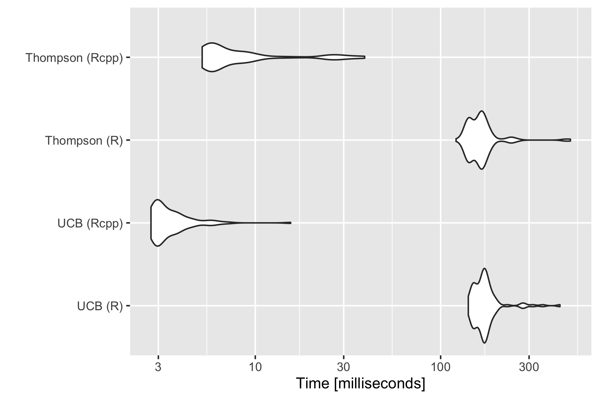
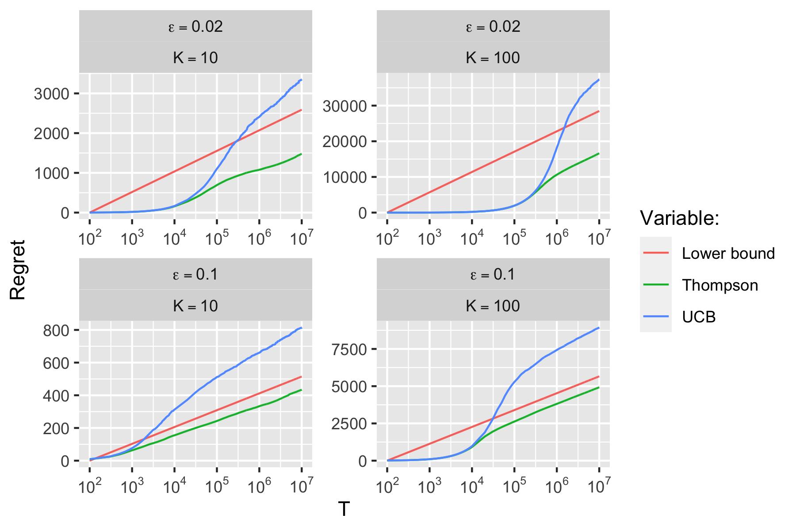

```{r setup, include=FALSE}
rm(list=ls())
knitr::opts_chunk$set(echo = TRUE, fig.align = "center")
library(data.table)
library(ggplot2)
lapply(
  list.files("R", pattern = "\\.R"),
  function(file) {
    source(file = file.path("R",file))
  }
)
```

# An empirical evalutation of Thompson Sampling [@chapelle2011empirical]

@chapelle2011empirical use simulations as well as real data set to demonstrate empirically that Thompson Sampling asymptotically outperforms Upper Confidence Bounds for solving Multi-Armed Bandit (MAB) problems. In the following, I will replicate their findings using synthetic data.

## A heads-up on the code

The empirical exercises have been implemented in `R`. To boost computational performance, bottleneck problems have been implemented in `C++` through `Rcpp`. Where appropriate I use object-oriented programming (`S3` classes). Code chunks in this document can be shown or hidden through buttons in their top right corner. All code is contained in the `./R` folder.

## Setting up the Bernoulli MAB

To start off with, let us create the MAB. As in @chapelle2011empirical we will consider a Bernoulli MAB: at each step $T$ the bandit is faced with the problem of choosing one of $K$ arms, all of which yield rewards that are generated by a Bernoulli distribution. For simulation purposes, two approaches come to mind:

1. Generate all $(T \times K)$ returns ex-ante and test the algorithms one that same data set.
2. Generate the returns on-line separately for each algorithm.

The first approach is perhaps more conventional in the context of benchmarking, since it provides a fair performance comparison of different algorithms with respect to the same data set. But since we will run the simulation many times over random realizations of the Bernoulli MAB, there is no need to have different algorithms work on the exact same realizations (asymptotically they are working with the same bandit problem).

The second approach is arguably more closely resembles real-world applications of reinforcement learning: at each step $T$ the bandit chooses an action and only then they observe the reward. It also has computational advantages, some of which are obvious and others that will become clearer below. An obvious benefit of generating rewards on the fly is the smaller memory costs associated with this approach. Storing a $(T \times K)$ matrix consumes a fair bit of working memory and the for the simulations we will need as much of that as possible.

In the end I have therefore opted for the second approach. The `mab` function below takes basic input parameters concerning the time horizon of the game, the (Bernoulli) probabilities of each arm and their distribution (only implemented for Bernoulli, but easily extended). It returns an `S3` class that will be used as the input for the different algorithms below.

```{r code=readLines("R/mab.R")}
```

## UCB

The code chunk below shows the implementation of the UCB algorithm in R. This implementation does not make use of `Rcpp` and is only shown for illustrative purposes. The code is thoroughly commented, so I here only talk to the high-level details. Like all other algorithms that we will see, `ucb_R` takes an object of class `mab` as its main input. The optional `action_values` argument can be used to supply initial values, should we have prior knowledge. By default all action values are initialized as zero. Regret is computed in each period as $V^*-Q(a_T)$ where $V^*$ is the optimal choice and $Q(a_T)$ represents the true reward probability of the arm chosen in period $T$. In particular, following @chapelle2011empirical here we have $V^*=0.5=Q(a^{(1)})$ and $Q(a^{(j)})=0.5-\varepsilon$ for all $j\ne1$, $j \in [1,K]$. It is easy to see that with this implementation, we can simply take the cumulative sum of the resulting vector of single-period regret to recover the total cumulative regret in period $T$ as specified in @auer2002finite, namely

$$
\begin{equation} 
\begin{aligned}
&& V^*T- \sum_{j=1}^{K}Q(a^{(j)})N_j(T)&= \\
\end{aligned}
(\#eq:regret)
\end{equation}
$$

where $N_j(T)$ denotes the number of times that arm $j$ has been chosen up until (and including) time $T$.

The function outputs an object of class `policy`, which contains the proposed solution to the MAB. The `policy` class uses a set of methods (e.g. `print` and `plot`) which will be used below.

```{r code=readLines("R/ucb_R.R")}
```

### Example

Before moving on to Thompson sampling, let us run a single game to see how the algorithm performs. The code chunk below generates the game using the `mab` function introduced above.

```{r}
eps <- 0.1
K <- 10
T_ <- 1000000
prob <- c(0.5,rep(0.5-eps,K-1))
bernoulli_mab <- mab(prob, horizon = T_)
```

Below we use the `Rcpp` version of the UCB algorithm to fit our model. For $T=`r T_`$ it only takes a few seconds to solve the problem. The `ucb_Rcpp` function is a wrapper function that executes the compiled `C++` code under the hood and returns a `policy` object. The `C++` code will not be discussed here but details can be found in the [annex](#annex). For $K=`r K`$ and $\varepsilon=`r eps`$, the cumulative regret after $T=`r T_`$ periods is around the same levels as the average cumulative regret for that specification in @chapelle2011empirical (Figure \@ref(fig:ucb-ex)).

```{r ucb-ex, fig.cap="An example run of the UCB algorithm."}
set.seed(42)
fitted <- ucb_Rcpp(bernoulli_mab)
plot(fitted)
```

## Thompson sampling

The implementation of Thompson sampling is very similar to UCB. Once again commented R code is shown below.

```{r code=readLines("R/thompson_R.R")}
```

### Example

Let us also look at an example run with Thompson sampling using the `Rcpp` implementation as before. We will use the same bandit as for the UCB above. As evident from Figure \@ref(fig:tho-ex) the cumulative regret after $T=`r T_`$ trials is much lower than for UCB. The curve describing the trajectory is also smoother than for UCB, perhaps indicating that when learning from posteriour probabilities, the bandit is less likely to stick with any particular choice throughout multiple consecutive periods.

```{r tho-ex, fig.cap="An example run of Thompson sampling."}
set.seed(42)
fitted <- thompson_Rcpp(bernoulli_mab)
plot(fitted)
```

## Performance benchmark

The choice to compile the algorithms in C++ through `Rcpp` was driven by the fact that we are looking at computationally very intensive simulations.^[It has in part been an exercise for me to get more familiar with `Rcpp`.] This implementation leads to massive performance boosts: Figure \@ref(fig:benchmark) shows a micro benchmark of the computing times of the different implementations.

```{r, eval=FALSE}
library(microbenchmark)
library(ggplot2)
mb <- microbenchmark(
    "UCB (R)" = {ucb_R(bernoulli_mab)},
    "UCB (Rcpp)" = {ucb_Rcpp(bernoulli_mab)},
    "Thompson (R)" = {thompson_R(bernoulli_mab)},
    "Thompson (Rcpp)" = {thompson_Rcpp(bernoulli_mab)},
    times = 100
)
p <- autoplot(mb)
ggsave("www/mb.png", width = 6, height = 4)
```

```{r benchmark, message=FALSE, warning=FALSE, fig.cap="Reduction in computing time due to compiling through `Rcpp`.", echo=FALSE}

```

## Simulations

First, let us set up a grid for the simulation, which will use both to draw the different parameters ($K$, $\varepsilon$):

```{r, eval=F}
library(data.table)
t_0 <- 1
T_ <- 1e7
K <- c(10,100)
eps <- c(0.02,0.1)
algos <- list(
  ucb = sim_ucb,
  thompson = sim_thompson
)
param_grid <- CJ(K=K,eps=eps,algo=names(algos))
```

The functions going into the list `algos` are compiled through `Rcpp` to also speed up that part of the process. Details can again be found in the [annex](#annex).

We will also set up a corresponding table to store the results from the simulation and eventually plot them. This involves performing a cross-join across the different parameters and the trials ($T=[1,`r T_`]$), which is efficiently implemented in `data.table`.

```{r, eval=F}
simulation <- CJ(K=K,eps=eps,T_=t_0:T_)
```

### Lower bound

The first variable we will add to `simulation` is the lower bound for the different parameter specifications. The lower bound is implemented according to the formulation in @chapelle2011empirical:

```{r code=readLines("R/lb.R")}
```

Next we apply this function for each $K$ and $\varepsilon$. Following @chapelle2011empirical we will shift the lower bound such that it passes through the origin at $T=100$. Again these computation can be done very efficiently using `data.table`:

```{r, eval=F}
simulation[,value:=lb(T_,c(0.5,rep(0.5-eps,K-1)),kl_bernoulli) - lb(100,c(0.5,rep(0.5-eps,K-1)),kl_bernoulli),by=.(K,eps)]
simulation[,variable:="lower_bound"]
```

### Algorithms

```{r, echo=FALSE}
n_sim <- 25 # number of simulations
```

Now let us finally turn to the simulation exercise. While the code `Rcpp` code runs fast, running multiple simulations of Bernoulli bandits with $K=100$ arms over $T=10^7$ trials is computationally challenging.^[On my personal device, an old single-core MacBook Pro '13 from mid-2010, these computations took 13 hours over all.] The code chunk below was used to run `n_sim`$=`r n_sim`$ simulations as in @chapelle2011empirical. While the authors chose to only update parameters every 100 iterations presumably to speed up computations, we do not use that simplification here and instead update every round. 

```{r, eval=FALSE}
start <- Sys.time()
simulation <- rbind(
  simulation,
  rbindlist(
    lapply(
      1:nrow(param_grid),
      function(param_spec) {
        list2env(c(param_grid[param_spec,]), envir = environment()) # unpack variables
        prob <- c(0.5,rep(0.5-eps,K-1)) # compute corresponding probabilities
        bernoulli_mab <- mab(prob, horizon = T_) # generate MAB
        unpack(bernoulli_mab) # unpack objects
        # initialize table to store output for parameter specification:
        simulation_spec <- data.table(K=K, eps=eps, T_=t_0:T_, value=0, variable=algo) 
        # run simulation:
        message(sprintf(
          "Starting with: %s, %i arms, eps=%0.2f, T=%i, n_sim=%i", 
          algo, 
          K, 
          eps,
          T_,
          n_sim
        ))
        regret <- algos[[algo]](
          n = n_sim,
          horizon = horizon,
          v_star = v_star,
          K = K,
          prob = prob
        )
        message(sprintf(
          "Done with: %s, %i arms, eps=%0.2f, T=%i, n_sim=%i", 
          algo, 
          K, 
          eps,
          T_,
          n_sim
        ))
        simulation_spec[,value:=cumsum(regret)] # store results
        return(simulation_spec)
      }
    )
  )
)
time_passed <- Sys.time() - start
print(time_passed)
saveRDS(simulation, file="results/simulation.rds")
```

### Final chart

The results are consistent with the findings in @chapelle2011empirical: for all parameter specifications both the UCB and Thompson Sampling attain sub-linearity before reaching $10^7$ trials. As expected, Thompson Sampling consistently outperforms UCB. Compared to the results in @chapelle2011empirical, both the UCB and to a lesser extent Thompson Sampling yield somewhat lower absolute levels of cumulative regret for any given $T$. This is likely due to the fact that here we have updated parameters continuously in each round, while @chapelle2011empirical only update every 100 trials.

```{r, eval=FALSE, echo=FALSE}
library(ggplot2)
library(scales)
dt_plot <- readRDS("results/simulation.rds")
bin_size <- ifelse(T_/1000>1,T_/1000,1)
n_start <- 500
dt_plot <- dt_plot[,bin:=(((T_) %/% bin_size))*bin_size]
dt_plot[,bin_idx:=1:.N,by=.(K,eps,variable,bin)]
dt_plot <- dt_plot[bin_idx==1 | (bin==0 & bin_idx %in% round(seq(100,bin_size-bin_size/n_start,length.out=n_start)))]
dt_plot[,bin_idx:=NULL]
dt_plot[,bin:=NULL]
dt_plot[,K:=sprintf("K==%i",K)]
dt_plot[,eps:=sprintf("epsilon==%0.2f",eps)]
dt_plot[,variable:=as.factor(variable)]
levels(dt_plot$variable) <- c("Lower bound", "Thompson", "UCB")
p <- ggplot(data=dt_plot[T_>=100]) +
  geom_line(aes(x=T_, y=value, colour=variable)) +
  scale_x_log10(
    breaks = trans_breaks("log10", function(x) 10^x),
    labels = trans_format("log10", math_format(10^.x))
  ) +
  scale_color_discrete(name="Variable:") +
  facet_wrap(K ~ eps, scales="free", labeller = label_parsed) +
  labs(
    x="T",
    y="Regret",
    title=sprintf("Number of simulations: %i", n_sim)
  )
p
ggsave("www/ps1_chart.png", width = 6, height = 4)
```

```{r chart, fig.cap="Comparison of algorithms as in @chapelle2011empirical.", echo=FALSE}

```

# References {-}

<div id="refs"></div>

# (APPENDIX) Annex {- #annex}

# `Rcpp` code

## UCB

```{Rcpp code=readLines("R/ucb.cpp"), eval=FALSE}
```

## Thompson Sampling

```{Rcpp code=readLines("R/thompson.cpp"), eval=FALSE}
```

# Session info

```{r}
utils::sessionInfo()
```
