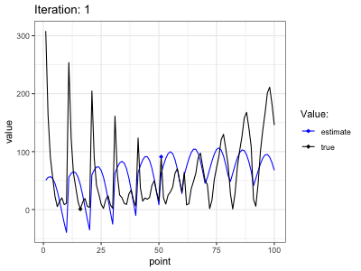

```{r setup, include=FALSE}
rm(list=ls())
knitr::opts_chunk$set(echo = TRUE, fig.align = "center")
library(data.table)
library(ggplot2)
library(scales)
lapply(
  list.files("R", pattern = "\\.R"),
  function(file) {
    source(file = file.path("R",file))
  }
)
rand_seed <- 123
theme_set(theme_bw())
```

# Gaussian processes

## Squared exponential kernel

The squared exponential kernel can be implemented in R as follows:

```{r code=readLines("R/kernel_se.R"), eval=FALSE, echo=TRUE}
```

We can use this kernel function to sample from a corresponding Gaussian process as follows:

```{r code=readLines("R/gaussian_process.R"), eval=FALSE, echo=TRUE}
```

The `kernel_matrix` function corresponds to $K(\mathbf{X}, \mathbf{X}')$. It simply applies the kernel function $k(\mathbf{x},\mathbf{x}')$ to all pair-wise combinations of samples in $\mathbf{X}$ and $\mathbf{X}'$.

Figure \@ref(fig:samples) shows 5 samples drawn from a Gaussian process with the the specified parameters. The samples look rather noisy because the specified noise variance is relatively high. A smaller choice for that parameter yields samples that are much smoother (Figure \@ref(fig:samples-2)).

```{r samples, echo=TRUE, fig.cap="Samples from a Gaussian process. Shaded area indicates the 95% confidence interval based on the variance prior. High noise variance."}
set.seed(rand_seed)
gp_samples <- gaussian_process_sampler(noise_sd=0.1,length_scale=1,signal_sd=1)
plot(gp_samples)
```

```{r samples-2, echo=TRUE, fig.cap="Samples from a Gaussian process. Shaded area indicates the 95% confidence interval based on the variance prior. Low noise variance."}
set.seed(rand_seed)
gp_samples <- gaussian_process_sampler(noise_sd=0.00001,length_scale=1,signal_sd=1)
plot(gp_samples)
```

## Gaussian Process Regression

To implement Gaussian Process Regression (GPReg) we first draw a small set of training points at random as well as larger set of (equidistant) test points.

```{r, echo=TRUE}
set.seed(rand_seed)
n_train <- 20
X <- runif(n_train, min = -7, max = 7)
X_test <- seq(-7,7,length.out=100)
```

GPReg can be implemented in R as follows:

```{r code=readLines("R/gaussian_process_regression.R"), echo=TRUE, eval=FALSE}
```

Applying this function to our train and test data using the default parameters as before yields the following picture:

```{r}
set.seed(rand_seed)
y <- gaussian_process(X=X)
gp_reg <- gaussian_process_regression(X=X, y=y, X_test = X_test)
plot(gp_reg)
ggsave("www/gp_reg.png", width = 7, height = 5)
```

Choosing instead a very low value for the length scale yield the following picture:

```{r, echo=TRUE}
set.seed(rand_seed)
length_scale <- 0.3
signal_sd <- 1.08
noise_sd <- 0.00005
y <- gaussian_process(
  X=X, 
  signal_sd=signal_sd, 
  length_scale=length_scale, 
  noise_sd = noise_sd
)
gp_reg <- gaussian_process_regression(
  X=X, y=y, X_test = X_test, 
  signal_sd=signal_sd, 
  length_scale=length_scale, 
  noise_sd = noise_sd
)
plot(gp_reg)
```

Finally, choosing a relatively large value for the length scale, we get the following picture:

```{r}
set.seed(rand_seed)
length_scale <- 3
signal_sd <- 1.16
noise_sd <- 0.89
y <- gaussian_process(
  X=X, 
  signal_sd=signal_sd, 
  length_scale=length_scale, 
  noise_sd = noise_sd
)
gp_reg <- gaussian_process_regression(
  X=X, y=y, X_test = X_test, 
  signal_sd=signal_sd, 
  length_scale=length_scale, 
  noise_sd = noise_sd
)
plot(gp_reg)
```

# Bayesian Optimization

## UCB

Here we will first briefly look at the implementation of Bayesian Optimization in R with UCB as the acquisition function. We shall first generate a small set of training points as well as a grid of pair-wise test point combinations. 

> Note: Because I have implemented everything from scratch and the hyperparameter optimization routine is computationally very expensive, I choose a testing grid that is not very granular. You can increase the `n_test` parameter to use a finer grid.

```{r}
set.seed(rand_seed)
x_lim <- c(-5,10)
y_lim <- c(0,15)
n_test <- 10
length_scale <- 1
signal_sd <- 1
noise_sd <- 0.1
hyper_params <- list(
  length_scale=length_scale,
  signal_sd=signal_sd,
  noise_sd=noise_sd
)
n <- 5
x_1 <- runif(n, min = -5, max = 10)
x_2 <- runif(n, min = 0, max = 15)
X <- cbind(x_1,x_2) # training points
# Test points:
X_test <- as.matrix(
  expand.grid( 
    x_1 = seq(min(x_lim),max(x_lim),length.out=n_test),
    x_2 = seq(min(y_lim),max(y_lim),length.out=n_test)
  )
)
```

With these inputs at hand, Bayesian Optimization can be implemented as follows:

```{r code=readLines("R/bayesian_optimization.R"), eval=FALSE, echo=TRUE}
```

Hyperparameters for the GP are tuned through the following multi-started optimization routine:

```{r code=readLines("R/optim_hyper.R"), eval=FALSE, echo=TRUE}
```

The code below runs Bayesian Optimization for a number of iterations:

```{r, eval=FALSE, echo=TRUE}
n_iter <- 50
bayes_optimum <- bayesian_optimization(
  objective_fun=branin,
  X=X, 
  X_test = X_test,
  n_iter=n_iter,
  hyper_params = hyper_params,
  verbose = 3,
  exploring_rate=0.5,
  fn_scale = -1,
  store_path = TRUE
)
saveRDS(bayes_optimum, file="results/bayes_optimum.rds")
```

```{r}
bayes_optimum <- readRDS("results/bayes_optimum.rds")
```

### Loss

Figure \@ref(fig:loss) shows the loss as a function of the number of iterations. Evidently, the Bayes Optimization gradually learns the true optimum of the function as it learnds from the observed data.

```{r loss, fig.cap="Loss over time."}
plot(bayes_optimum)
```

### Learning path

```{r, eval=FALSE}
plot_path(bayes_optimum)
anim_save("www/bayes_opt.gif")
```

Let us have a quick look at what is actually going on under the hood. Figure \@ref(fig:anim) shows in black the true function values evaluated at the pair-wise test point combinations. The blue line reflects the corresponding posterior means that the Bayes Optimizer learns through time. The blue shaded area indicates the 95% confidence interval based on the learned posterior variances. 

The Bayes Optizer gradually gets better at estimated the true function values. As it explores different points on the test grid uncertainty around these points shrinks. Sometimes the overall magnitude of the confidence interval suddenly appears to change which corresponds to occasions when the estimates of optimal hyperparameters change significantly. Eventually the learned function values are very close to true function values and the proposed optimum corresponds to the true optimum (among the test points).

```{r anim, fig.cap="The learning path of the algorithm."}

```

## Benchmarking acquisition functions

Finally, the plot below shows the effect of the exploration parameter for different acquisition functions.


