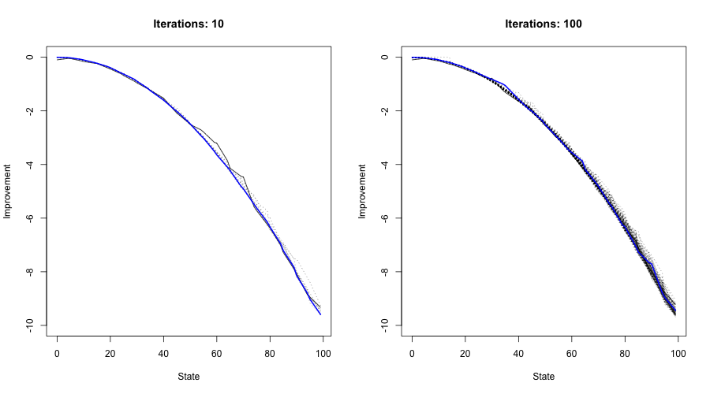

```{r setup, include=FALSE}
rm(list=ls())
knitr::opts_chunk$set(echo = FALSE, fig.align = "center", out.width = 500)
library(data.table)
library(ggplot2)
library(scales)
library(microbenchmark)
lapply(
  list.files("R", pattern = "\\.R"),
  function(file) {
    source(file = file.path("R",file))
  }
)
rand_seed <- 123
theme_set(theme_bw())
```

There are two fundamental challenges of reinforcement learning (RL):

1. Reward and transition functions are unknown.
2. The state and action space are large.

Approximate Dynamic Programming deals with both challenges. The code that implements the approximate DP methodologies is contained in `R/approximate_dyn_programming.R`. A HTML report can be found [here](R/approximate_dyn_programming.html). The functions and methods are built on top of the `mdp` class for Markov Decision Process that was already implemented for [Problem Set 1](ps1_answers.html).

# Approximate Policy Evaluation

First we will redefine the Markov Decision Process from [Problem Set 1](ps1_answers.html). This time we will not provide the entire state and action space, but instead rely solely on the reward and transition functions to define the MDP.

```{r, echo=TRUE}
mdp <- readRDS("results/mdp.rds")
```

Next we code up the different feature maps:

```{r, echo=TRUE}
# Fine map:
phi_fine <- function(x, state_space) {
  phi <- as.numeric(0:length(state_space)==x)
  return(phi)
}
# Coarse map:
phi_coarse <- function(x, state_space, width=5) {
  idx <- 1:((length(state_space))/width)
  bounds <- data.table(lb=width*(idx-1),ub=width*idx-1)
  phi <- bounds[,as.numeric(x %between% .(lb,ub))]
  return(phi)
}
# Piece-wise map:
phi_pwl <- function(x, state_space, width=5) {
  # Coarse part:
  idx <- 1:((length(state_space))/width)
  bounds <- data.table(lb=width*(idx-1),ub=width*idx-1)
  phi_coarse <- bounds[,as.numeric(x %between% .(lb,ub))]
  # Other part:
  phi_other <- phi_coarse * (x - width*(idx - 1)) / width
  phi <- c(phi_coarse, phi_other)
  return(phi)
}
# List:
feature_maps <- list(
  fine = phi_fine,
  coarse = phi_coarse,
  pwl = phi_pwl
)
```

Finally we add to the `mdp` instance the `width` argument, which will be used by the feature maps below.

```{r, echo=TRUE}
mdp$width <- 5
```

While in [Problem Set 1](ps1_answers.html) we supplied a function to the `mdp` instance that would be used to compute a matrix describing the probabilities of transitioning from one state to another, here we will need to supply a function that actually generates a random transition based on the transition function:

```{r, echo=TRUE}
transition_fun <- function(state, action, state_space, p) {
  x <- state + rbinom(1,1,p) - rbinom(1,1,action)
  new_state <- min(max(state_space), max(x,0))
  return(new_state)
}
mdp$transition_fun <- transition_fun
```

As before we introduce the two deterministic policies:

```{r, echo=TRUE}
# Policies:
lazy <- function(state, action_space) {
  action <- rep(action_space[1], length(state))
  return(action)
}
aggressive <- function(state, action_space) {
  action <- ifelse(state<50, action_space[1], action_space[2])
  return(action)
}
# Lazy:
policy_lazy <- lazy(state = mdp$state_space, action_space = mdp$action_space)
# Aggressive:
policy_aggr <- aggressive(state = mdp$state_space, action_space = mdp$action_space)
policies <- list(
  lazy = policy_lazy,
  aggr = policy_aggr
)
```

Finally, the chunk below sets up a grid for the numerical exercise. For each policy a single trajectory is generated and will serve as the input for the evaluation functions. At this point it is useful to observe that the choice of the deterministic policy affects the empirical distribution of the sampled transitions. In particular, recall that the transition function depends on a parameter $p=0.5$ that governs the Bernoulli probability that the queue grows by one in any given transition period. Meanwhile $q|\pi$ governs the probability that the length of the queue will be reduced by one. Note that for both policies $p<q|\pi$ and hence we should expect that for long enough sampling periods, smaller queue lengths will occur much more often than longer queue lengths. Moreover, since aggressive policy takes a harder stance on long queues, we would expect the sampling proportion of high states to be even smaller on average than for the lazy policy. 

Figure \@ref(fig:ecdf) illustrates this point: it shows the empirical distributions of the state trajectories for the two policies. Clearly, small states are more frequent and in the case of the aggressive policy the high states are almost never visited, despite the fact that we initialized the sampling at the terminal state $N=99$. As we shall see below, this has non-trivial implications on the performance of our approximate policy evaluation methods.

> NOTE: As mentioned on Google Classroom, I only used up to `1e5` transitions. Loops are terribly slow in `R` and I work on a very old device from mid 2010. Using `R` in combination with `C++` as I did for the second problem would have resolved this problem, but I was too time constrained to go that extra step on this occasion. As we will see, the patterns that one would have expected to show up actually do show up even with a smaller number of transitions.

```{r, echo=TRUE, eval=FALSE}
set.seed(42)
n_iter <- c(1e3,1e4,1e5)
grid <- CJ(n_iter=n_iter, feature_map=names(feature_maps), policy=names(policies))
trajectories <- list(
  lazy = sim_trajectory(mdp, policies[["lazy"]], n_iter = max(n_iter)),
  aggr = sim_trajectory(mdp, policies[["aggr"]], n_iter = max(n_iter))
)
saveRDS(trajectories, file="results/trajectories.rds")
```

```{r ecdf, fig.height=3, fig.width=6, fig.cap="Empirical distribution of sampled transitions."}
trajectories <- readRDS("results/trajectories.rds")
trajectories <- rbindlist(
  lapply(
    names(trajectories),
    function(i) {
      trajectories[[i]][,type:=i]
    }
  )
)
ggplot(data=trajectories, aes(x=state)) +
  geom_histogram(alpha=0.25, col="blue", bins=50) +
  facet_grid(
    cols=vars(type)
  )
```

The first code chunk below runs the approximate policy evaluation algorithms. Here LSTD is regularized relatively conservatively. The second code chunk further below instead uses only a tiny amount of regularization.

```{r, eval=FALSE, echo=TRUE}
# Set up the grid:
regularization <- 1e-5
set.seed(42)
sim_output <- rbindlist(
  lapply(
    1:nrow(grid),
    function(i) {
      list2env(c(grid[i,]), envir = environment())
      message(
        sprintf(
          "Running: feature map: %s, policy: %s, n_iter: %i", 
          feature_map, policy, n_iter
        )
      )
      mdp$feature_map_fun <- feature_maps[[feature_map]]
      traj_temp <- trajectories[[policy]][1:n_iter,]
      out_td <- td(mdp, traj_temp)
      V_td <- out_td$V
      out_lstd <- lstd(mdp, traj_temp, sigma=regularization)
      V_lstd <- out_lstd$V
      output <- data.table(
        td = V_td,
        lstd = V_lstd,
        n_iter = n_iter,
        policy = policy,
        feature_map = feature_map
      )
      return(output)
    }
  )
)
sim_output <- melt(sim_output, measure.vars = c("td", "lstd"))
sim_output[,state:=mdp$state_space,by=.(policy, feature_map, variable, n_iter)]
saveRDS(sim_output, file="results/ps4_sim_reg.rds")
```

```{r, eval=FALSE, echo=TRUE}
regularization <- 1e-30 
set.seed(42)
sim_output <- rbindlist(
  lapply(
    1:nrow(grid),
    function(i) {
      list2env(c(grid[i,]), envir = environment())
      message(
        sprintf(
          "Running: feature map: %s, policy: %s, n_iter: %i", 
          feature_map, policy, n_iter
        )
      )
      mdp$feature_map_fun <- feature_maps[[feature_map]]
      traj_temp <- trajectories[[policy]][1:n_iter,]
      out_td <- td(mdp, traj_temp)
      V_td <- out_td$V
      out_lstd <- lstd(mdp, traj_temp, sigma = regularization)
      V_lstd <- out_lstd$V
      output <- data.table(
        td = V_td,
        lstd = V_lstd,
        n_iter = n_iter,
        policy = policy,
        feature_map = feature_map
      )
      return(output)
    }
  )
)
sim_output <- melt(sim_output, measure.vars = c("td", "lstd"))
sim_output[,state:=mdp$state_space,by=.(policy, feature_map, variable, n_iter)]
saveRDS(sim_output, file="results/ps4_sim.rds")
```


```{r}
sim_output_reg <- readRDS("results/ps4_sim_reg.rds")
sim_output <- readRDS("results/ps4_sim.rds")
```

Figures \@ref(fig:agg-heavy) to \@ref(fig:lazy-barely) show the approximate evaluations of the two deterministic policies for different numbers of sample transitions (across columns) and the different feature maps (across rows). The first thing to note is that broadly speaking the estimates tend to be less noisy as the number of sample transitions increases. This is of course intuitive, since a larger sample of transitions contains more information about the value of the policies.

Another broad pattern is that estimates are more noisy for higher states. This is not surprising in light of the observation we made above that higher states are simply not visited very often. Unsurprisingly, this effect is stronger for the aggressive policy. It clearly demonstrates the limitations of temporal differencing, which produces very noisy estimates for the aggressive policy. LSTD generally performs much better, though here the level of regularization matters. Intuitively, when regularizing too heavily the LSTD produces biased estimates for high states which are only observed at low frequency (Figure \@ref(fig:agg-heavy)). For lower levels of regularization this bias is mitigated to some extent (Figure \@ref(fig:agg-barely)).

Finally, we also observe that unsurprisingly the different feature maps lead to different estimates. The coarse map yields a step-wise value function as expected. The fine feature map is more 'continuous', but also more noisy. The piece-wise linear feature map can be thought of as a compromise between the coarse and the fine map and generally produces good outcomes.

```{r agg-heavy, fig.cap="Approximate evaluation of aggressive policy, heavily regularized."}
p <- ggplot(data=sim_output_reg[policy=="aggr"], aes(x=state, y=value, linetype=variable)) +
  geom_line() +
  facet_grid(
    rows=vars(feature_map),
    cols=vars(n_iter)
  )
p + 
  labs(title="Aggressive policy, heavily regularized")
```

```{r lazy-heavy, fig.cap="Approximate evaluation of lazy policy, heavily regularized."}
p <- ggplot(data=sim_output_reg[policy=="lazy"], aes(x=state, y=value, linetype=variable)) +
  geom_line() +
  facet_grid(
    rows=vars(feature_map),
    cols=vars(n_iter)
  )
p + 
  labs(title="Lazy policy, heavily regularized")
```

```{r agg-barely, fig.cap="Approximate evaluation of aggressive policy, barely regularized."}
p <- ggplot(data=sim_output[policy=="aggr"], aes(x=state, y=value, linetype=variable)) +
  geom_line() +
  facet_grid(
    rows=vars(feature_map),
    cols=vars(n_iter)
  )
p + 
  labs(title="Aggressive policy, barely regularized")
```

```{r lazy-barely, fig.cap="Approximate evaluation of lazy policy, barely regularized."}
p <- ggplot(data=sim_output[policy=="lazy"], aes(x=state, y=value, linetype=variable)) +
  geom_line() +
  facet_grid(
    rows=vars(feature_map),
    cols=vars(n_iter)
  )
p + 
  labs(title="Lazy policy, barely regularized")
```

\FloatBarrier
\pagebreak

# Approximate Policy Iteration

```{r}
mdp$feature_map_fun <- phi_pwl
```


```{r, eval=FALSE}
n_iter <- c(10,100)
png("www/optimal_polciy_approx.png", width = 900, height = 500)
par(mfrow=c(1,length(n_iter)))
policy_iter_results <- list()
for (i in 1:length(n_iter)) {
  policy_iter_results[[i]] <- appr_policy_iteration(
    mdp,
    n_iter = n_iter[i], 
    n_trans = 1e4, 
    verbose = 1,
    sigma = 1e-30
  )
}
saveRDS(policy_iter_results, file="results/optimal_policy_approx.rds")
dev.off()
```

```{r}
optimal_policy <- readRDS(file="results/optimal_policy_approx.rds")
```

Figure \@ref(fig:approx-iter) shows the approximate policy evaluations over the course of 10 and 100 iterations. I used the piece-wise linear feature map. It should be noted that the plotted value functions represent the approximate value as returned by LSTD for each iteration. The solid black line represents the approximate value of the first random policy, while the blue line represents the approximate value of the final proposed policy.

Consistent with the results from the previous section, policy iteration is noisy for high states. Increasing the iteration count does not appear to resolve that issue. In fact I noted that already in the very first iteration the improved policy is nearly optimal (as judged by the optimal policy that was found in the first problem set). The problem is that no matter how good the proposed policy is, the estimation of its value is noisy in each iteration and in particular so for high states. Once again this is driven by the fact that high states are visited much less frequently during sampling than the low states.

```{r approx-iter, fig.cap="Approximate policy evaluations over the course of 10 and 100 iterations."}

```

Nonetheless the proposed policies are close two optimal. Figure \@ref(fig:policies) compares the proposed policies after 10 iterations (`few_iter`) and 100 iterations (`many_iter`) to the optimal policy that was found in the [Problem Set 1](ps1_answers.html). Clearly, approximate policy iteration produces sensible policies (evidently better than random) even though there are some mistakes. Figure \@ref(fig:policies) also demonstrates that increasing the number of iterations does not appear to be useful. This is not all too surprising since even if supplied with the optimal policy $\pi^*$ approximate policy iterations involves an imperfect estimate of the corresponding value function in each iteration. Then policy improvement is run based on that imperfect estimate, which in the best case again returns the optimal policy, but not necessarily.

> NOTE: For reasons outlined above I have worked with only `10e4` sample transitions. A higher choice can be expected to yield more accurate policy evaluations through LSTD and therefore also a higher chance of exactly identifiying the optimal policy. Yet my intuition is that using a higher number of iterations is not helpful.

```{r policies, fig.cap="Proposed policies after a few and many iterations compared to optimal policy."}
value_iter_results <- readRDS("results/value_iter.rds")
val_it <- value_iter_results[[4]]
N <- length(val_it$policy)
proposed_policies <- rbind(
  data.table(state=1:N, action=val_it$policy,type="optimal"),
  data.table(state=1:N, action=optimal_policy[[1]]$policy,type="few_iter"),
  data.table(state=1:N, action=optimal_policy[[2]]$policy,type="many_iter")
)
ggplot(data=proposed_policies, aes(x=state, y=action)) +
  geom_point(cex=.25, colour="blue") +
  facet_grid(
    rows=vars(type)
  )
```


